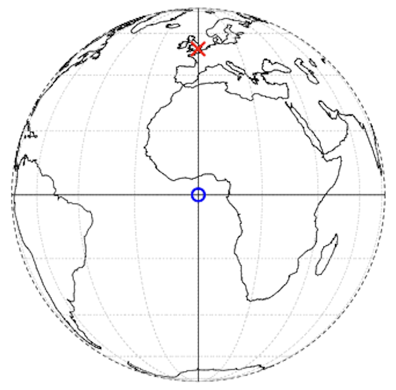
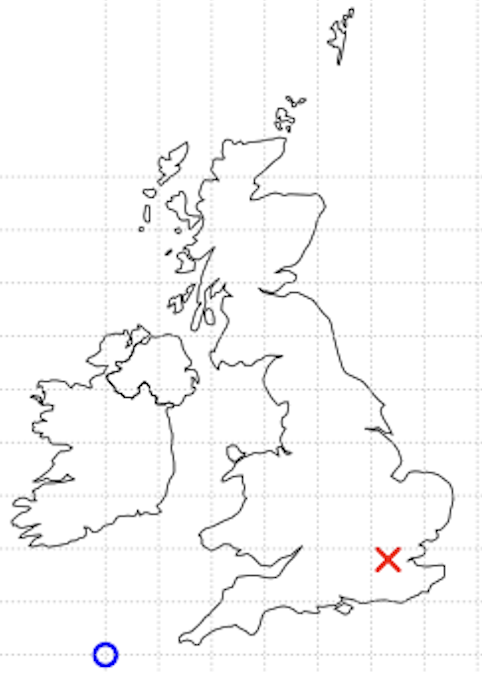
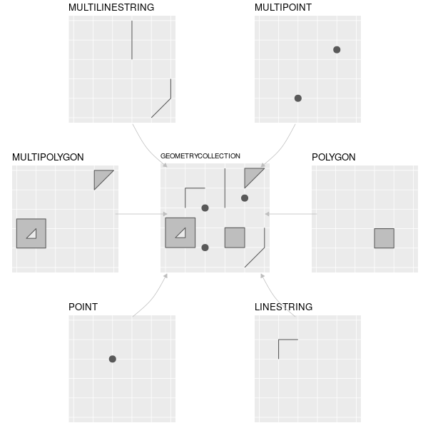
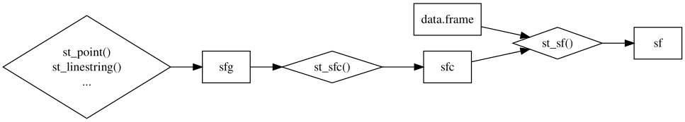
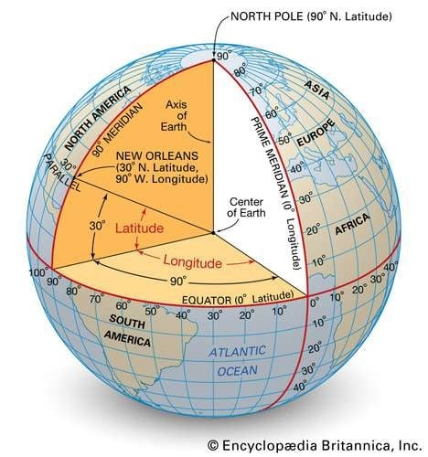
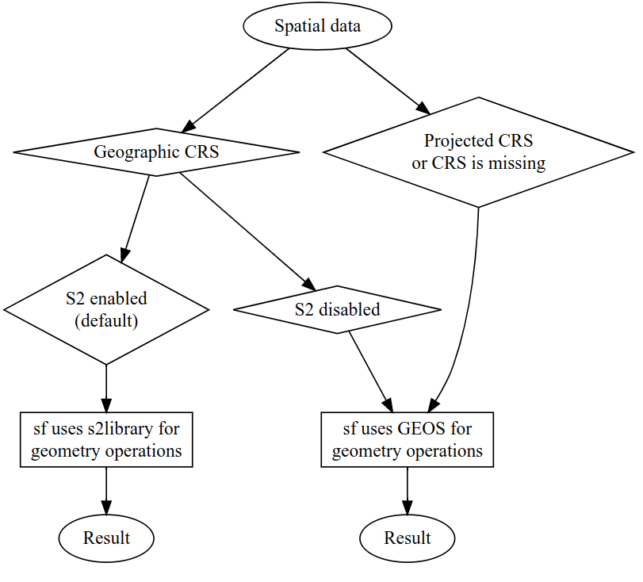
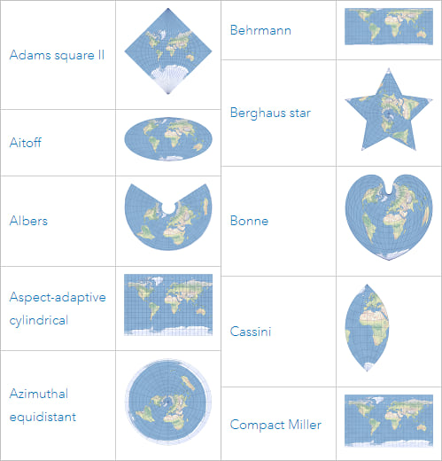
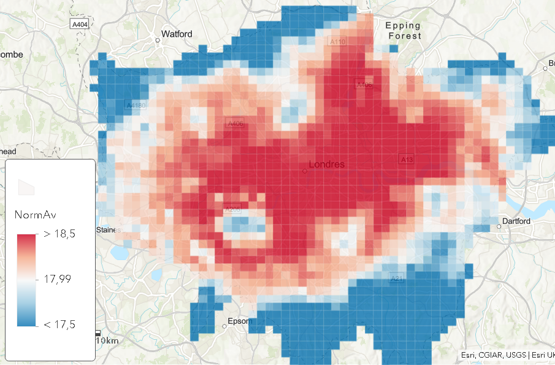
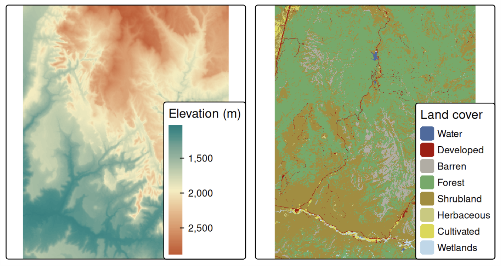

---
format:
  revealjs:
    center: false
    css: styles.css
    theme: white
    slide-number: true
    transition: fade
    width: 1600
    height: 900
    auto-stretch: false

execute:
  echo: false
---
## Spatial Data Analysis {.title-slide-low}

### Lecture 1 - Spatial data basics

Sant’Anna School of Advanced Studies

**Matteo Coronese**  
m.coronese@santannapisa.it

June 2026

---

## {background-image="fuga.jpg" background-size="contain" background-color="white"}

## {background-image="piccione.jpg" background-size="contain" background-color="white"}

## {background-image="intro16.png" background-size="contain" background-color="black"}

## Why are spatial data becoming essential in social science?

Many economic and social processes are inherently spatial:

- climate exposure differs across locations;
- labor markets are geographically connected;
- pollution crosses administrative borders;
- housing prices diffuse across neighborhoods;
- accessibility shapes opportunities;
- policies affect nearby areas differently.

Spatial data allow us to measure these mechanisms explicitly.

<br>

And here is the good news: spatial data are often among the most challenging data to manipulate (don't worry!). Once you learn how to work with them, handling most other types of data will feel much easier.

---

## Spatial data change how we measure phenomena

Without spatial information, we often observe only administrative-level information. But every unit is considered as indipendent.

In many applications... geography matters!

Spatial data allow us to measure:

- exposure;
- proximity;
- accessibility;
- segregation;
- spillovers;
- neighborhood effects;

<br>

::: {.nonincremental}
Spatial methods transform location into measurable information.
:::


## What will we learn in this course?

### Lecture 1 Spatial data basics

- spatial data types (vector and raster);
- coordinate reference systems (CRS);
- spatial data structures in R;
- basic visualization and manipulation with `sf` and `terra`.

<br>

### Lecture 2 — Operating with spatial datasets

### Lecture 3 — Elements of spatial dependence and econometrics

### Lecture 4 — Applied spatial workflows

<br>

We are going to use R software $\rightarrow$ handling of spatial data & statistics/econometrics. Further information on R for geocomputation can be found at [https://r.geocompx.org/](https://r.geocompx.org/)


## How is spatial information represented?
<div style="height:0.1em;"></div>

Spatial information is typically represented in two ways:

- ### Vector data
Handled with `sf` package.
  - points, lines, polygons

  Dominates in social sciences, used to represent discrete objects:
  - cities, roads, administrative boundaries


- ### Raster data
Handled with `terra` package.
  - regular grids of cells

  Dominates in environmental sciences, used to represent continuous surfaces:
  - temperature, elevation, pollution, satellite imagery

---

## Points live in a space: the CRS

:::: {.columns .top-align}
::: {.column width="60%"}

Basic element of vector data: **points**. They can represent:

- self-standing features (e.g. bus stops);
- or be combined into **lines** and **polygons**.

A point is identified by coordinates within a coordinate reference system (CRS).

- Coordinates only make sense once a reference system is specified.

  - For example, in a CRS London $\rightarrow$ c(-0.1, 51.5)
    - its location is  0.1° West and 51.5° North (w.r.t. Greenwich Prime Meridian and Equator). 
  - In another CRS (British National Grid) London $\rightarrow$ c(530000, 180000)
    - 530 km East and 180 km North w.r.t another origin.


:::
::: {.column width="40%" align="center"}
<center>



</center>
:::
::::

---


## `sf` objects behave like ordinary data frames

An `sf` object is also a data frame. This means that standard data manipulation functions can be applied directly to spatial data. The geometry column is preserved automatically.

```{r eval=TRUE, echo=TRUE}
library(sf)
library(spData)

class(world) #the object world is loaded with spData
```

```{r eval=FALSE, echo=TRUE}
names(world)
```

Selecting variables:
```{r echo=TRUE}
world_small <- world[, c("name_long", "continent", "subregion")]
ncol(world_small) #why 4? the geometry column is sticky!
```

Creating new variables:
```{r echo=TRUE}
world$pop_density <- world$pop / world$area_km2
head(world$pop_density)
```

Because `sf` objects are data frames, they work **amazingly well** with `dplyr` and `tidyverse`. More on this next lecture.


---

## Basic structure of an `sf` object

An `sf` object stores:

- ordinary attributes (e.g. iso_a2, name_long);
- a geometry column (type MULTIPOLYGON);
- coordinate reference system information (WGS84).

<div style="height:0.5em;"></div>

```{r echo=TRUE}
options(width = 120)
head(world_small,8)
```

---

## Basic maps with `sf`

The default plotting methods make spatial exploration immediate.

<div style="height:0.5em;"></div>

:::: {.columns .top-align}
::: {.column width="50%"}
```{r echo=TRUE}
plot(world) #plots attributes
```
:::
::: {.column width="50%" align="center"}
```{r echo=TRUE}
plot(world[,"pop"]) #plot a single attributes
```
:::
::::

using `ggplot` you can create much nicer maps!

But let's take a step back...

---

## Geometry types
Geometries are the basic building blocks of **simple features** (hence the name `sf`).

:::: {.columns .top-align}
::: {.column width="50%"}
Vector geometries are built from a few basic elements:

<div style="height:0.5em;"></div>

- `POINT`
- `LINESTRING`
- `POLYGON`

<div style="height:0.7em;"></div>

And their multi-part versions:

- `MULTIPOINT`
- `MULTILINESTRING`
- `MULTIPOLYGON`
:::
::: {.column width="50%" align="center"}
<center>

</center>

:::
::::


---


## Creating geometries

:::: {.columns}

::: {.column width="55%" align="center"}
- A **point** is given by coordinate in two dimensions
- A **linestring** is a sequence of points with a straight line connecting them
- A **polygon** is a sequence of points that form a closed, non-intersecting ring.

```{r echo=TRUE}
#| class: small-code

point <- st_point(c(5, 2))

linestring <- st_linestring(
  rbind(
    c(1, 5),
    c(4, 4),
    c(4, 1),
    c(2, 2),
    c(3, 2)
  )
)

polygon <- st_polygon(
  list(
    rbind(
      c(1, 5),
      c(2, 2),
      c(4, 1),
      c(4, 4),
      c(1, 5)
    )
  )
)
```


:::

::: {.column width="45%" align="center"}
<center>

```{r echo=FALSE, fig.width=4, fig.height=8}
par(mfrow = c(3, 1),
    mar = c(2, 2, 2, 1))

plot(point,
     axes = TRUE,
     xlim = c(0, 6),
     ylim = c(0, 6),
     pch = 16,
     cex = 2,
     main = "POINT")

plot(linestring,
     axes = TRUE,
     xlim = c(0, 6),
     ylim = c(0, 6),
     lwd = 3,
     main = "LINESTRING")

plot(polygon,
     axes = TRUE,
     xlim = c(0, 6),
     ylim = c(0, 6),
     col = "lightblue",
     border = "black",
     lwd = 2,
     main = "POLYGON")
```
</center>
:::

::::


## Creating geometries II

:::: {.columns}

::: {.column width="55%" align="center"}
- Simple feature standard also allows multiple geometries of a single type to exist within a single feature within “multi” version of each geometry type. 
- Use rbind for points, a list of rbinds of lines, and a list of a list of rbinds for polygons.

```{r echo=TRUE}
#| class: small-code

multipoint <- st_multipoint(
  rbind(
    c(5, 2),
    c(1, 3),
    c(3, 4),
    c(3, 2)
  )
)

multilinestring <- st_multilinestring(
  list(
    rbind(
      c(1, 5),
      c(4, 4),
      c(4, 1),
      c(2, 2),
      c(3, 2)
    ),
    rbind(
      c(1, 2), 
      c(2, 4)
    )
  )
)

multipolygon <- st_multipolygon(
  list(
    list(
      rbind(
        c(1, 5),
        c(2, 2),
        c(4, 1),
        c(4, 4),
        c(1, 5)
      )
    ),
    list(
      rbind(
        c(0, 2),
        c(1, 2),
        c(1, 3),
        c(0, 3),
        c(0, 2)
      )
    )
  )
)
```


:::

::: {.column width="45%" align="center"}
<center>

```{r echo=FALSE, fig.width=4, fig.height=8}
par(mfrow = c(3, 1),
    mar = c(2, 2, 2, 1))

plot(multipoint,
     axes = TRUE,
     xlim = c(0, 6),
     ylim = c(0, 6),
     pch = 16,
     cex = 2,
     main = "MULTIPOINT")

plot(multilinestring,
     axes = TRUE,
     xlim = c(0, 6),
     ylim = c(0, 6),
     lwd = 3,
     main = "MULTILINESTRING")

plot(multipolygon,
     axes = TRUE,
     xlim = c(0, 6),
     ylim = c(0, 6),
     col = "lightblue",
     border = "black",
     lwd = 2,
     main = "MULTIPOLYGON")
```
</center>
:::

::::


## Creating geometries III

:::: {.columns}

::: {.column width="55%" align="center"}
- Finally, a geometry collection can contain any combination of geometries including (multi)points and linestrings

```{r echo=TRUE}
#| class: small-code

geometrycollection <- st_geometrycollection(
  list(
    st_multipoint(
      rbind(
        c(5, 2),
        c(1, 3),
        c(3, 4),
        c(3, 2)
      )
    ),
    st_linestring(
      rbind(
        c(1, 5),
        c(4, 4),
        c(4, 1),
        c(2, 2),
        c(3, 2)
      )
    )
  )
)

```


:::

::: {.column width="45%" align="center"}
<center>
<div style="height:150px;"></div>

```{r echo=FALSE, fig.width=5, fig.height=5}
par(mfrow = c(1, 1),
    mar = c(2, 2, 2, 1))

plot(geometrycollection,
     axes = TRUE,
     xlim = c(0, 6),
     ylim = c(0, 6),
     pch = 16,
     cex = 2,
     main = "MULTIPOINT")
```
</center>
:::

::::


---

## From simple feature geometries to simple feature columns
::: {.smaller}

One `sfg` object contains only a single simple feature geometry. A **simple feature geometry column** (`sfc`) is a list of `sfg` objects

In most cases, an `sfc` object contains objects of the same geometry type (e.g. point).

```{r echo=TRUE}
point1 <- st_point(c(5, 2))
point2 <- st_point(c(1, 3))
points_sfc <- st_sfc(point1, point2)
points_sfc
```

It is also possible to create an `sfc` object from `sfg` objects with different geometry types.

```{r echo=TRUE}
multilinestring1 <- st_multilinestring(list(rbind(c(1, 5), c(4, 4), c(4, 1), c(2, 2), c(3, 2)), 
                             rbind(c(1, 2), c(2, 4))))
point_multilinestring_sfc <- st_sfc(point1, multilinestring1)
point_multilinestring_sfc
st_geometry_type(point_multilinestring_sfc)

```
:::


---

## CRS in `sfc`

`sfc` objects can additionally store information on the CRS. The default value is NA (Not Available), as can be verified with `st_crs()`:

```{r echo=TRUE}
st_crs(points_sfc)
```

All geometries in `sfc` objects must have the same CRS. A CRS can be specified with the crs argument of `st_sfc()` (or `st_sf()`), which takes a CRS identifier provided as a text string.

```{r echo=TRUE}
points_sfc_wgs <- st_sfc(point1, point2, crs = "EPSG:4326")
cat(substr(st_crs(points_sfc_wgs)$wkt, 1, 700)) # print CRS (only first 4 lines of output shown)
```


---

## From `sfc` to spatial objects (`sf`, or simple features)


An `sf` object combines:

- a table of attributes;
- a geometry column `sfc`.

<div style="height:0.5em;"></div>

:::: {.columns}

::: {.column width="50%" align="center"}

```{r eval=FALSE, echo=TRUE}

#| class: small-code
rome_point <- st_point(c(12.4964, 41.9028))       # sfg object

rome_geom <- st_sfc(
  rome_point,
  crs = "EPSG:4326"
)                                                 # sfc object

rome_attrib <- data.frame(
  name = "Rome",
  temperature = 30,
  date = as.Date("2023-06-21")
)                                                 # data.frame object

rome_sf <- st_sf(
  rome_attrib,
  geometry = rome_geom
)

rome_sf
```

```{r echo=FALSE}
rome_point <- st_point(c(12.4964, 41.9028))

rome_geom <- st_sfc(
  rome_point,
  crs = "EPSG:4326"
)

rome_attrib <- data.frame(
  name = "Rome",
  temperature = 30,
  date = as.Date("2023-06-21")
)

rome_sf <- st_sf(
  rome_attrib,
  geometry = rome_geom
)
```
::: 

::: {.column width="50%" align="center"}
```text
Simple feature collection with 1 feature and 3 fields
Geometry type: POINT
Dimension:     XY
Bounding box:  xmin: 12.4964 ymin: 41.9028 xmax: 12.4964 ymax: 41.9028
Geodetic CRS:  WGS 84

  name temperature       date                geometry
1 Rome          30 2023-06-21 POINT (12.4964 41.9028)
```
<br>


::: 
::::


---

## More on Coordinate Reference Systems (CRSs)

<div style="height:0.5em;"></div>

:::: {.columns}

::: {.column width="50%" align="center"}

A Coordinate Reference System (CRS) defines:

- how coordinates are measured;
- the reference model of the Earth (*datum*);
- the coordinate units; 
- how coordinates relate to physical locations.

Problem: The Earth is approximately spherical, while most maps are flat...

:::
::: {.column width="50%" align="center"}

Two broad classes of CRS are commonly used:

- **Geographic CRS** $\rightarrow$ Spherical Earth
  - longitude / latitude
  - angular units (degrees)
  - different *datums* and reference points

- **Projected CRS** $\rightarrow$ Flat representation of Earth
  - planar coordinates
  - linear units (usually meters, but you can check with `st_crs(sf_object)$ud_unit`)
  - Different ways of representing the Earth's surface on a plane
  
:::

::::

<div style="height:1em;"></div>

<center>
**The same location has different coordinates under different CRS.**
</center>
---

## Geographic coordinates: WGS84

**Which CRS should we use?**  
There is no universally “correct” CRS: the choice depends on the application. Anyway, most of the time the answer is WGS84 (`EPSG:4326`). Used by GPS systems; online maps; global spatial datasets.

:::: {.columns}

::: {.column width="60%" align="center"}
Coordinates are expressed as:

- **Longitude**
  - *East* of Greenwich = positive 
  - *West* of Greenwich = negative
- **Latitude**
  - *North* of the Equator = positive 
  - *South* of the Equator = negative

In `sf`, coordinates are always stored as:

```text
(longitude, latitude)
```
:::
::: {.column width="40%" align="center"}


:::
::::

---

## Geographic CRS are not planar coordinates

Longitude and latitude are angles, not distances.
```{r echo=TRUE}
st_coordinates(rome_sf)
```

:::: {.columns}
::: {.column width="55%" align="center"}
A simple plot treats coordinates as if they were Cartesian

```{r eval=FALSE, echo=TRUE}
plot(st_geometry(world),
     col = "grey90",
     border = "grey70",
     axes = TRUE)

plot(rome_sf,
     add = TRUE,
     pch = 16,
     col = "red",
     cex = 2)
```
:::
::: {.column width="45%" align="center"}
<div style="height:1.2em;"></div>
```{r echo=FALSE, eval=TRUE}
plot(st_geometry(world),
     col = "grey90",
     border = "grey70",
     axes = TRUE)

plot(rome_sf,
     add = TRUE,
     pch = 16,
     col = "red",
     cex = 2)
```
:::
::::
<div style="margin-top:-1em;"></div>
Bear in mind that degrees of longitude do not correspond to constant distances on Earth --> meridians converge toward the poles.

    - 1° longitude at the Equator ≈ 111 km 
    - 1° longitude close to London ≈ 69 km 
    - 1° longitude close to North Pole ≈ 0 km 
    - Degrees of latitude are instead approximately constant in distance (1° ≈ 111 km)
---

## Transforming coordinates with `st_transform()`

Spatial objects can be easily reprojected into another CRS. From geographic (WGS84) to projected (Web Mercator, the one used by Google Maps to display). 

<div style="height:0.5em;"></div>

```{r echo=TRUE}
rome_3857 <- st_transform(rome_sf, 3857)

rome_3857

st_crs(rome_3857)$ud_unit

```

- The same location now has different coordinates because it is represented in a projected CRS.
- The reference origin, in the specific case of Web Mercator, is still Equator-Greenwich.
- Projected CRS usually use planar coordinates measured in meters. But these are "projected meters", not exact physical distances on the Earth's surface....

---

## Every projection distorts the Earth
:::: {.columns}
::: {.column width="50%"}
::: {.small}
> “All happy families are alike; each unhappy family is unhappy in its own way.” 
>
>- Lev Tolstoj, Anna Karenina. 
:::

:::
::: {.column width="50%"}
::: {.small}
> "Each projection is in distorted in its own way". 
>
>- Me, in this lecture
:::
:::
::::

:::: {.columns}

::: {.column width="50%"}

```{r eval=FALSE, echo=TRUE}
world_3857 <- st_transform(world, 3857)
plot(st_geometry(world_3857),
     col = "grey90",
     border = "grey70",
     axes = TRUE)

plot(rome_3857,
     add = TRUE, axes = TRUE, pch = 16, cex = 2)
```

<br>
Why is Antarctica so big? 

**No flat map can preserve all geographic properties simultaneously**.

Different projections preserve different properties: shape; area; distance; direction.
:::

::: {.column width="50%"}
<div style="margin-top:-3em;"></div>
```{r eval=TRUE, echo=FALSE, fig.width=6, fig.height=7}
world_3857 <- st_transform(world, 3857)
plot(st_geometry(world_3857),
     col = "grey90",
     border = "grey70",
     ylim = c(-3000000,1000000),
     axes = TRUE)

plot(rome_3857,
     add = TRUE,
     axes = TRUE,
     pch = 16,
     cex = 2)
```

:::

::::


---

## Geometry operations in `sf`

Modern versions of `sf` can use two different geometry engines.  
This can affect the outcome of spatial operations.

:::: {.columns}

::: {.column width="50%"}

<center>

</center>

:::

::: {.column width="50%"}

- Geographic CRS (`EPSG:4326`) can use the spherical geometry engine `S2`;
- Projected CRS typically use planar geometry (`GEOS`);
- Spatial operations therefore depend on both:
  - the CRS;
  - the geometry engine.

:::

::::


---

## Why projections still matter

With `S2` enabled (default), many operations on geographic CRS work well directly on the sphere.

With `S2` disabled, some geometry operations (often involving distances, areas, buffers) may become problematic because longitude and latitude are treated as planar coordinates. 

<div style="height:0.5em;"></div>

:::: {.columns}
::: {.column width="50%"}

Generally, projected CRS are often more convenient for:

- local analysis (for small enough regions, the Earth is approximately flat)
- planar geometry operations;
- distances and buffers;
- spatial algorithms based on Euclidean geometry.
:::
::: {.column width="50%"}
<center>

</center>

:::
::::


---

## Buffers under different CRS assumptions

:::: {.columns}

::: {.column width="50%"}

```{r echo=TRUE}
#| class: small-code

italy <- world[world$name_long == "Italy", ]

# S2 ON
sf_use_s2(TRUE)

rome_buffer_s2 <- st_buffer(
  rome_sf,
  dist = 100000
)

# S2 OFF
sf_use_s2(FALSE)

rome_buffer_deg <- st_buffer(
  rome_sf,
  dist = 1 #1 degree!!! using 100000 would be SUPER WRONG!
)

# Back ON
sf_use_s2(TRUE) #useless

# Projected
rome_3857 <- st_transform(rome_sf, 3857)
italy_3857 <- st_transform(italy, 3857)

rome_buffer_proj <- st_buffer(
  rome_3857,
  dist = 100000
)

```
:::

::: {.column width="50%"}

- Why the first one is a circle? Correct km...
- Why the second one is an ellipsoid? It is a cirle in the lon-lat space, but lon-lat are not equal in terms of km...
- Why the third one si smaller? If you'd use a projection specific for Rome, first and third would look much more similar...
:::

::::


:::: {.columns}

::: {.column width="33%"}

```{r echo=FALSE, fig.width=5, fig.height=5}
plot(st_geometry(italy),
     col = "grey95",
     border = "grey70",
     axes = TRUE,
     main = "Geographic + S2 ON")

plot(st_geometry(rome_buffer_s2),
     add = TRUE,
     col = rgb(0,0,1,0.3),
     border = "blue")

plot(st_geometry(rome_sf),
     add = TRUE,
     pch = 16,
     col = "red",
     cex = 1.5)
```

:::

::: {.column width="33%"}

```{r echo=FALSE, fig.width=5, fig.height=5}
plot(st_geometry(italy),
     col = "grey95",
     border = "grey70",
     axes = TRUE,
     main = "Geographic + S2 OFF")

plot(st_geometry(rome_buffer_deg),
     add = TRUE,
     col = rgb(1,0,0,0.3),
     border = "red")

plot(st_geometry(rome_sf),
     add = TRUE,
     pch = 16,
     col = "red",
     cex = 1.5)
```

:::

::: {.column width="33%"}

```{r echo=FALSE, fig.width=5, fig.height=5}
plot(st_geometry(italy_3857),
     col = "grey95",
     border = "grey70",
     axes = TRUE, 
     main = "Projected CRS (3857)")

plot(st_geometry(rome_buffer_proj),
     add = TRUE,
     col = rgb(0,1,0,0.3),
     border = "darkgreen")

plot(st_geometry(rome_3857),
     add = TRUE,
     pch = 16,
     col = "red",
     cex = 1.5)
```

:::

::::


---

## Circular on Earth or circular in coordinates?

<div style="margin-top:-1em;"></div>

:::: {.columns}

::: {.column width="33%"}

```{r echo=FALSE, fig.width=5, fig.height=5}
plot(st_geometry(italy),
     col = "grey95",
     border = "grey70",
     axes = TRUE,
     main = "Geographic + S2 ON")

plot(st_geometry(rome_buffer_s2),
     add = TRUE,
     col = rgb(0,0,1,0.3),
     border = "blue")

plot(st_geometry(rome_sf),
     add = TRUE,
     pch = 16,
     col = "red",
     cex = 1.5)
```

:::

::: {.column width="33%"}

```{r echo=FALSE, fig.width=5, fig.height=5}
plot(st_geometry(italy),
     col = "grey95",
     border = "grey70",
     axes = TRUE,
     main = "Geographic + S2 OFF")

plot(st_geometry(rome_buffer_deg),
     add = TRUE,
     col = rgb(1,0,0,0.3),
     border = "red")

plot(st_geometry(rome_sf),
     add = TRUE,
     pch = 16,
     col = "red",
     cex = 1.5)
```

:::

::: {.column width="33%"}

```{r echo=FALSE, fig.width=5, fig.height=5}
plot(st_geometry(italy_3857),
     col = "grey95",
     border = "grey70",
     axes = TRUE, 
     main = "Projected CRS (3857)")

plot(st_geometry(rome_buffer_proj),
     add = TRUE,
     col = rgb(0,1,0,0.3),
     border = "darkgreen")

plot(st_geometry(rome_3857),
     add = TRUE,
     pch = 16,
     col = "red",
     cex = 1.5)
```

:::

::::

<div style="margin-top:-2.5em;"></div>


:::: {.columns}

::: {.column width="33%"}

```{r echo=FALSE, fig.width=5, fig.height=5}
plot(st_geometry(italy),
     col = "grey95",
     border = "grey70",
     axes = TRUE,
     main = "Geographic + S2 ON (asp=1)",
     asp=1)

plot(st_geometry(rome_buffer_s2),
     add = TRUE,
     col = rgb(0,0,1,0.3),
     border = "blue")

plot(st_geometry(rome_sf),
     add = TRUE,
     pch = 16,
     col = "red",
     cex = 1.5)
```

:::

::: {.column width="33%"}

```{r echo=FALSE, fig.width=5, fig.height=5}
plot(st_geometry(italy),
     col = "grey95",
     border = "grey70",
     axes = TRUE,
     main = "Geographic + S2 OFF (asp=1)",
     asp=1)

plot(st_geometry(rome_buffer_deg),
     add = TRUE,
     col = rgb(1,0,0,0.3),
     border = "red")

plot(st_geometry(rome_sf),
     add = TRUE,
     pch = 16,
     col = "red",
     cex = 1.5)
```

:::

::: {.column width="33%"}

```{r echo=FALSE, fig.width=5, fig.height=5}
# Projected with 32633
rome_32633 <- st_transform(rome_sf, 32633)
italy_32633 <- st_transform(italy, 32633)

rome_buffer_proj_loc <- st_buffer(
  rome_32633,
  dist = 100000
)

plot(st_geometry(italy_32633),
     col = "grey95",
     border = "grey70",
     axes = TRUE, 
     main = "Projected CRS (32633)")

plot(st_geometry(rome_buffer_proj_loc),
     add = TRUE,
     col = rgb(0,1,0,0.3),
     border = "darkgreen")

plot(st_geometry(rome_32633),
     add = TRUE,
     pch = 16,
     col = "red",
     cex = 1.5)
```

:::

::::


---

## A common and safe workflow

::: {.smaller}


:::: {.columns}

::: {.column width="60%"}
With `S2` enabled, many geometry operations work well directly on geographic CRS. However, for local or regional analysis, it is often convenient to:

1. start from a geographic CRS (`EPSG:4326`);
2. project the data into a suitable local projected CRS;
3. perform geometry operations;
4. optionally transform back to WGS84.

<div style="height:0.7em;"></div>
```{r echo=TRUE}
rome_32633 <- st_transform(rome_sf, 32633)
# UTM (Universal Transverse Mercator) Zone 33N
# A local projected CRS covering much of Italy.
# Distances are expressed in meters and distortions are very small
# around Rome.

rome_buffer_32633 <- st_buffer(
  rome_32633,
  dist = 100000
)

rome_buffer_wgs84 <- st_transform(
  rome_buffer_32633,
  4326
)
```

:::

::: {.column width="40%"}
<div style="margin-top:-1.5em;"></div>
```{r echo=FALSE, fig.width=7, fig.height=6}
#big plot
par(fig = c(0.0000001, 1, 0.0000001, 1))
plot(
  st_geometry(italy),
  col = "grey95",
  border = "grey70",
  axes = TRUE,
  main = "Geodesic vs UTM 33N"
)

box()

plot(st_geometry(rome_buffer_s2),
     add = TRUE,
     col = rgb(0,0,1,0.3),
     border = "blue")

plot(st_geometry(rome_sf),
     add = TRUE,
     pch = 16,
     col = "blue",
     cex = 1.5)

plot(st_geometry(rome_buffer_wgs84),
     add = TRUE,
     col = NA,
     border = "red")


#zoom
par(
  fig = c(0.01, 0.43, 0.01, 0.45),
  mar = c(0,0,0,0),
  new = TRUE
)


plot(
  st_geometry(italy),
  col = "grey95",
  border = "grey70",
  #axes = FALSE,
  xlab = "",
  ylab = "",
  main = "",
  xlim = c(11.5, 12.2),
  ylim = c(41.2, 42.3)
)

plot(st_geometry(rome_buffer_s2),
     add = TRUE,
     col = rgb(0,0,1,0.3),
     border = "blue")

plot(st_geometry(rome_sf),
     add = TRUE,
     pch = 16,
     col = "blue",
     cex = 1.5)

plot(st_geometry(rome_buffer_wgs84),
     add = TRUE,
     col = NA,
     border = "red")

box()
```

This workflow is especially useful when:

- distances or areas are important;
- the study region is relatively small;
- planar geometry algorithms or GIS libraries assuming Euclidean geometry are used.


:::

::::

:::

<!-- Raster -->


--- 

## Raster data

Raster data divide space into a *regular grid of cells*.

:::: {.columns}

::: {.column width="60%"}

Raster objects can contain:

- a single layer;
- multiple layers (e.g. temperature over time).

Each cell of one raster layer can only hold a single value.

The value might be continuous

- elevation; pollution;
- temperature; precipitation;
- remote sensing variables;

or categorical 

- land cover; soil types.
:::

::: {.column width="40%" align="center"}
<div style="margin-top:-2em;"></div>
<center>



</center>

:::
::::


## Raster structure

Rasters are fundamentally a matrix of values + spatial metadata. 

Unlike vector data, rasters are NOT stored as many polygons: once you know the coordinates of *origin* (in `terra`, the upper left corner of the matrix) and the *resolution* (the amount of space covered by each cell), cell locations are reconstructed. 

:::: {.columns}

::: {.column width="30%"}

Example: If

```text
origin = (0,100)
resolution = 10
```

then:

- cell (1) covers:
```text
x: 0 → 10
y: 90 → 100
```

- cell (12) covers:
```text
x: 10 → 20
y: 80 → 90
```
:::

::: {.column width="70%" align="center"}
<div style="margin-top:-1em;"></div>
```{r echo=FALSE, fig.width=10.5, fig.height=6.5, fig.align='center'}
library(tidyverse)

expand.grid(
  x = seq(5, 95, by = 10),
  y = seq(95, 5, by = -10)
) %>%
  arrange(desc(y), x) %>%
  mutate(label = 1:100) %>% 
  mutate(title="Raster Index") %>% 
  ggplot() + 
  geom_tile(aes(x=x, y=y), fill="transparent", color="black") +
  geom_text(aes(x = x, y = y, label = label), size=3) + 
  annotate(
    "text",
    x = 5,
    y = 105,
    label = "origin",
    color="red"
  ) +
  annotate(
    "point",
    x = 0,
    y = 100,
    color="red"
  ) + 
  facet_wrap(.~title) +
  scale_x_continuous(breaks=seq(0,100, by=10)) +
  scale_y_continuous(breaks=seq(0,100, by=10)) +
  theme_minimal() + 
  theme(
    panel.grid=element_blank(),
    axis.title = element_blank()
  )-> g1

set.seed(2)
expand.grid(
  x = seq(5, 95, by = 10),
  y = seq(95, 5, by = -10)
) %>%
  arrange(desc(y), x) %>%
  mutate(label = sample(c(1:1000,rep(NA,20)),100)) %>% 
  mutate(title="Raster values") %>% 
  ggplot() + 
  geom_tile(aes(x=x, y=y), fill="transparent", color="black") +
  geom_text(aes(x = x, y = y, label = label), size=3) + 
  facet_wrap(.~title) +
  scale_x_continuous(breaks=seq(0,100, by=10)) +
  scale_y_continuous(breaks=seq(0,100, by=10)) +
  theme_minimal() + 
  theme(
    panel.grid=element_blank(),
    axis.title = element_blank()
  )-> g2


set.seed(2)
expand.grid(
  x = seq(5, 95, by = 10),
  y = seq(95, 5, by = -10)
) %>%
  arrange(desc(y), x) %>%
  mutate(label = sample(c(1:1000,rep(NA,20)),100)) %>% 
  mutate(title="Values colored") %>% 
  ggplot() + 
  geom_tile(aes(x=x, y=y, fill=label), color="black") + 
  facet_wrap(.~title) +
  scale_x_continuous(breaks=seq(0,100, by=10)) +
  scale_y_continuous(breaks=seq(0,100, by=10)) +
  theme_minimal() + 
  theme(
    panel.grid=element_blank(),
    axis.title = element_blank(),
    legend.position = "none"
  )-> g3


cowplot::plot_grid(cowplot::plot_grid(NULL, g1, NULL,
    ncol = 3,
    rel_widths = c(1, 2, 1)), cowplot::plot_grid(g2,g3), nrow=2)
```

:::

::::


---

## Inspecting a raster object

:::: {.columns}

::: {.column width="50%"}

```{r echo=TRUE}
library(terra)

f <- system.file(
  "ex/elev.tif",
  package = "terra"
) #load the file

r <- rast(f) #convert to raster

r
```

:::

::: {.column width="50%"}

A `SpatRaster` object stores:

- the raster dimensions (`nrow`, `ncol`, `nlyr`);
- the spatial resolution (cell size) *in degrees* (because of geographic CRS)
- the spatial extent (`xmin`, `xmax`, `ymin`, `ymax`); *in degrees* (because of geographic CRS)
- the coordinate reference system (CRS);
- the raster values (in the header *min* and *max* are shown)


:::

::::

<div style="height:0.7em;"></div>

- Raster grids are regular in the coordinate system $\rightarrow$ NOT equal physical distances on the Earth's surface. 
- In WGS84, as you go further away from the equator, cells become physically narrower east-west toward the poles $\rightarrow$ cover smaller physical areas.


## Plotting and inspecting rasters
:::: {.columns}

::: {.column width="50%"}

Raster values can be visualized directly.

```{r echo=TRUE, fig.width=12, fig.height=9}
plot(r)
```


:::

::: {.column width="50%"}

Useful inspection functions include:

```{r echo=TRUE, eval=FALSE}
summary(r)
global(r, "mean", na.rm=TRUE) #specific terra function, disk-backed. Very useful with large data!
minmax(r) #specific terra function
```

Raster matrices are indexed consistently with geographic orientation:
columns increase eastward, rows increase southward

```{r echo=TRUE}
values(r)[222:224]
r[3,32]
r[(3-1)*ncol(r) +32]

```

Simple math operations are applied cell-by-cell.

```{r echo=TRUE, eval=FALSE}
r - global(r, "mean", na.rm=TRUE)[1,1]#global returns a data.frame with nrows=nlyr
#The raster geometry remains unchanged. Only raster values are modified.
```

:::

::::

## Multi-layer rasters
:::: {.columns}

::: {.column width="50%"}

Raster objects can contain multiple aligned layers, each with the same geometry. Each layer stores one value per cell.

```{r echo=TRUE}
# create a multilayer raster
s <- c(r, r * 2, r * 3)
s
```
```{r echo=TRUE, eval=FALSE}
s[[1]]          # first raster layer
```
```{r echo=TRUE}
s[[1]][10]      # 10th cell of the first layer
```

:::

::: {.column width="50%"}

```{r echo=TRUE, eval=TRUE}
s[[2]][3,5]     # row 3, column 5 of the second layer
values(s)[1:5,] # first 5 cells across all layers
global(s, "mean", na.rm=TRUE) # works by layer
```

```{r echo=TRUE, eval=FALSE}
plot(s)
```

```{r echo=FALSE, fig.width=9, fig.height=3}
plot(
  s,
  nc = 3
)
```
:::

::::

## Reprojecting a raster object

:::: {.columns}

::: {.column width="50%"}

```{r echo=TRUE}
r_3857 <- project(r, "EPSG:3857")

r_3857
```

:::

::: {.column width="50%"}

After reprojection:

- raster cells become regular in projected coordinates (not meters, projected meters!);
- spatial resolution is now expressed in projected meters;
- New values! Raster values must be resampled onto a new grid.
- Before dimensions were 90X95. Now they are 108X74 (more rectangular). Why? 

:::

::::
<div style="height:0.1em;"></div>

- **Vector data**: same geometries, same attributes, just different coordinates
- **Raster data**: brand new grid + resampled values (nearest neighbor; bilinear; cubic interpolations)

Raster reprojection is often more invasive than vector reprojection. For this reason, raster datasets are frequently analyzed in their native CRS unless reprojection is necessary for the analysis.


## Reprojecting a raster object II

Even visually, you can spot some differences.


```{r echo=FALSE, fig.width=15, fig.height=8}
par(mfrow = c(1,2))

plot(r,
     main = "WGS84")

plot(r_3857,
     main = "Web Mercator")
```


---

## Common spatial file formats

:::: {.columns}

::: {.column width="50%"}

### Vector data

- Shapefile (`.shp`)
- GeoPackage (`.gpkg`)
- GeoJSON (`.geojson`)
- CSV with coordinates

Imported in R with:

```r
st_read()
```

:::

::: {.column width="50%"}

### Raster data

- GeoTIFF (`.tif`)
- NetCDF (`.nc`)
- ASCII grid (`.asc`)

Imported in R with:

```r
rast()
```

:::

::::

Spatial files usually also store CRS information. Otherwise, you should **know** in which CRS the coordinates were originally recorded (e.g. longitude-latitude values in a CSV file), and explicitly assign the CRS. In `sf`:


```r
st_crs(object) <- 4326        # assign CRS
st_transform(object, 3857)   # reproject coordinates
```

In `terra`:

```r
crs(raster) <- "EPSG:4326"      # assign CRS
project(raster, "EPSG:3857")    # reproject raster
```


---

## Better maps with `ggplot`

Spatial analysis is also about communicating spatial patterns effectively.

While `plot` is useful for exploration, `ggplot` makes much better graphs.

:::: {.columns}

::: {.column width="33%"}

<div style="height:2em;"></div>
```{r echo=FALSE, fig.width=5, fig.height=4}
world_eu <- world[world$continent == "Europe", ]

plot(
  world_eu["pop_density"],
  xlim = c(-30, 180),
  ylim = c(40, 90),
  main = "Base plot"
)
```

:::

::: {.column width="33%"}
<div style="margin-top:-0.3em;"></div>
```{r echo=FALSE, fig.width=5, fig.height=7}
ggplot(world[world$continent == "Europe",]) +
  geom_sf(
    aes(fill = pop_density),
    color = "white",
    linewidth = 0.15
  ) +
  scale_fill_viridis_c(
    trans = "log10",
    option = "magma",
    name = "Population\ndensity"
  ) +
  labs(
    title = "Population density across Europe"
  ) +
  coord_sf(
    crs = 3035,
    xlim = c(-30, 160),
    ylim = c(10, 90),
    default_crs = st_crs(4326),
    expand = FALSE
  )+ 
  labs(
 title = "Population density across Europe",
 subtitle = "Ggplot"
  )+
  theme_void() +
  theme(
    plot.title = element_text(
      face = "bold",
      size = 16,
      hjust = 0.5
    ),
      plot.subtitle = element_text(
      hjust = 0.5
      ),
    legend.position = "right"
  )
```
 
:::

::: {.column width="33%"}
It allows:

  - better, more variegated aesthetics;
  - layering of multiple spatial objects;
  - legends and scales;
  - faceting;
  - integration with the `tidyverse` ecosystem;
  - publication-quality figures.
:::

::::


---

## A first map
::: {.smaller}

:::: {.columns}

::: {.column width="50%"}

`ggplot` builds figures by adding layers. For spatial data, the most important layer is `geom_sf()`, which automatically plots sf objects and handles

- geometries;
- coordinate reference systems;
- map extents.

```{r echo=TRUE, eval=FALSE}
ggplot(world) +
  geom_sf()
```

:::

::: {.column width="50%"}

Spatial objects can be combined naturally. Each `geom_sf()` adds a new layer to the map. You can add as many layers as you want: vectors, rasters, and plenty of other `geoms` (points, lines, areas, distributions etc...)


```{r echo=TRUE, eval=FALSE}
ggplot() +
  geom_sf(data = world) +
  geom_sf(
    data = rome_sf,
    color = "red",
    size = 3
  )
```

:::

::::

<div style="margin-top:-3.5em;"></div>
<center>

```{r echo=FALSE, fig.width=9, fig.height=7}
ggplot() +
  geom_sf(data = world) +
  geom_sf(
    data = rome_sf,
    color = "red",
    size = 3
  )
```

</center>
:::


--- 

## Layers, vectors and rasters

:::: {.columns}

::: {.column width="50%"}

```{r echo=TRUE, eval=FALSE}
#install packages rnaturalearth, geodata, maps, tidyterra
countries <- rnaturalearth::ne_countries(
  scale = "medium",
  returnclass = "sf"
)

eu <- countries %>% 
  filter(region_un%in%c("Europe", "Asia", "Africa"))

tavg <- geodata::worldclim_global(
  var = "tavg",
  res = 10,
  path = tempdir()
)

temp <- mean(tavg)

temp_eu <- crop(
  temp,
  ext(-15, 40, 35, 72)
)

names(temp_eu)

data("world.cities", package = "maps")

cities <- st_as_sf(
  subset(world.cities, pop > 1500000),
  coords = c("long", "lat"),
  crs = 4326
)

cities_lab <- cbind(
  st_drop_geometry(cities),
  st_coordinates(cities)
)

ggplot() +
  tidyterra::geom_spatraster(
    data = temp_eu,
    aes(
      fill = mean
    ),
    alpha = 0.85
  ) +
  geom_sf(
    data = eu,
    fill = NA,
    color = "black",
    linewidth = 0.2
  ) +
  geom_sf(
    data = cities,
    aes(size=pop),
    color = "darkgreen",
    show.legend = FALSE
  ) +
  geom_text(
    data = cities_lab,
    aes(
      X,
      Y,
      label = name
    ),
    size = 3,
    nudge_y = 1
  ) +
  coord_sf(
    xlim = c(-15, 40),
    ylim = c(35, 72),
    expand = FALSE
  ) +
  labs(
    title = "Mean annual temperature and major European cities (1970-2000)"
  ) +
  scale_fill_gradient2(
    low = "#2166AC",
    mid = "#F7F7F7",
    high = "#B2182B",
    midpoint = 10,
    na.value = "aliceblue",
    name = "Temperature (°C)"
  ) +
  theme_void() +
  theme(
    plot.title = element_text(
      face = "bold",
      size = 18,
      hjust = 0.5
    ),
    legend.position = "bottom"
  )
```

:::

::: {.column width="50%" align="center"}

<center>
```{r echo=FALSE, fig.width=6.7, fig.height=8}
#install packages rnaturalearth, geodata, maps, tidyterra
countries <- rnaturalearth::ne_countries(
  scale = "medium",
  returnclass = "sf"
)

eu <- countries %>% 
  filter(region_un%in%c("Europe", "Asia", "Africa"))

tavg <- geodata::worldclim_global(
  var = "tavg",
  res = 10,
  path = tempdir()
)

temp <- mean(tavg)

temp_eu <- crop(
  temp,
  ext(-15, 40, 35, 72)
)

data("world.cities", package = "maps")

cities <- st_as_sf(
  subset(world.cities, pop > 1500000),
  coords = c("long", "lat"),
  crs = 4326
)

cities_lab <- cbind(
  st_drop_geometry(cities),
  st_coordinates(cities)
)

ggplot() +
  tidyterra::geom_spatraster(
    data = temp_eu,
    aes(
      fill = mean
    ),
    alpha = 0.85
  ) +
  geom_sf(
    data = eu,
    fill = NA,
    color = "black",
    linewidth = 0.2
  ) +
  geom_sf(
    data = cities,
    aes(size=pop),
    color = "darkgreen",
    show.legend = FALSE
  ) +
  geom_text(
    data = cities_lab,
    aes(
      X,
      Y,
      label = name
    ),
    size = 3,
    nudge_y = 1
  ) +
  coord_sf(
    xlim = c(-15, 40),
    ylim = c(35, 72),
    expand = FALSE
  ) +
  labs(
    title = "Mean annual temperature\nand major European cities (1970-2000)"
  ) +
  scale_fill_gradient2(
    low = "#2166AC",
    mid = "#F7F7F7",
    high = "#B2182B",
    midpoint = 10,
    na.value = "aliceblue",
    name = "Temperature (°C)"
  ) +
  theme_void() +
  theme(
    plot.title = element_text(
      face = "bold",
      size = 18,
      hjust = 0.5
    ),
    legend.position = "bottom"
  )

```

</center>

:::

::::


