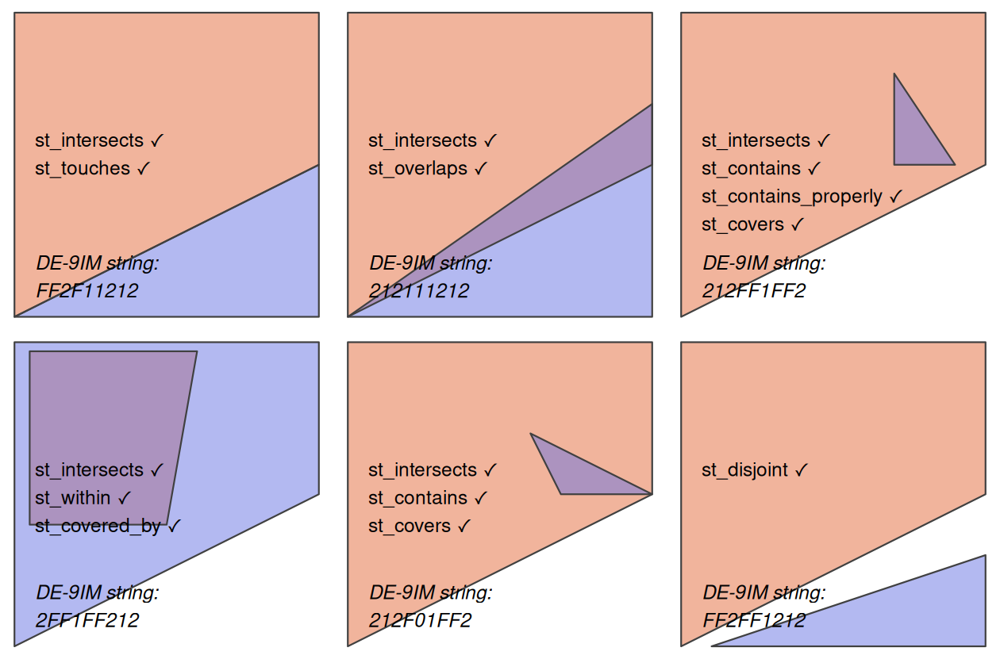

---
format:
  revealjs:
    center: false
    css: styles.css
    theme: white
    slide-number: true
    transition: fade
    width: 1600
    height: 900
    auto-stretch: false

execute:
  echo: false
---

## Spatial Data Analysis {.title-slide-low}

### Operating with spatial datasets

Sant’Anna School of Advanced Studies

**Matteo Coronese**\
m.coronese\@santannapisa.it

June 2026


## What will we learn in this course?

### Lecture 1 Spatial data basics

### Lecture 2 — Operating with spatial datasets

- Who belongs to what? (topological relationships)
- How far is it? (distance relationships)
- What is nearby? (buffers and neighborhoods)
- At which scale do we measure outcomes? (aggregation)
- How to build an exposure measure (raster extraction)

<br>

### Lecture 3 — Elements of spatial dependence and econometrics

### Lecture 4 — Applied spatial workflows


---

## Constructing spatial variables

Spatial variables are rarely directly observed. They are usually constructed from:

:::: {.columns .top-align}
::: {.column width="56%"}

- spatial relationships;
- distances;
- overlaps;
- neighboring structures;
- aggregation over space.

Examples:

- distance to the nearest hospital;
- average pollution within a municipality;
- population exposed to flooding;
- neighboring economic activity;
- temperature exposure over agricultural land.

:::
::: {.column width="44%"}

<div style="margin-top:6em; text-align:center;">

Spatial data manipulation is often aimed at
**transforming spatial data into measurable, meaningful quantities**.

</div>

:::
::::
---

## Spatial relationships between geometries

Many spatial variables emerge from relationships between objects. Typical questions include:

- Which points fall inside a polygon?
- Which regions share a border?
- Which observations are within a given distance?
- What is the nearest location?
- Which areas overlap?

Spatial relationships can be conceptually based either on:

<div style="height:0.5em;"></div>

:::: {.columns .top-align}
::: {.column width="50%"}

### Topology 
- depends on relative spatial arrangement, independendtly of their distance
- is a binary predicate (`TRUE` / `FALSE`)
- is $x$ inside $y$? Does $x$ overlaps with $y$?

:::
::: {.column width="50%"}

### Distance: 
- depends on physical distance measurements
- mostly continuous, can be binary
- how far is $x$ w.r.t $y$? Is $x$ within 100km w.r.t $y$?
    
:::
::::

---

## Topological relationships


:::: {.columns .middle}

::: {.column width="45%"}

- **Binary topological relationships** are qualitative, logical statements (`TRUE` / `FALSE`).

- They form the theoretical basis for spatial joins (merging data based on their spatial relations).


- *Order* is important! 
  - e.g. `equals`, `intersects`, `crosses`, `touches` and `overlaps` are symmetrical
  - e.g. `contains` and `within` are not

- Topological relationships do not require meaningful distance units.

:::

::: {.column width="55%" align="center"}

<center>
Their formal mathematical definition can be quite complex. 
We will instead focus on the `sf` functions that implement them.
</center>

<center>

</center>


:::

::::


---

## Simple topological relations
::: {.smaller}

:::: {.columns .middle}

::: {.column width="50%"}

`st_intersects()` is a catch-all predicate, identifying cases of *touch*, *cross* or *within*. Examples:

- which cities belong to which countries;
- which regions overlap;
- which observations fall inside a buffer.

```{r echo=FALSE}
library(sf)
library(tidyverse)
library(magrittr)
```

```{r echo=TRUE}
polygon_matrix <- cbind(
  x = c(0, 0, 1, 1,   0),
  y = c(0, 1, 1, 0.5, 0)
)
polygon_sfc <- st_sfc(st_polygon(list(polygon_matrix)))
#we could have created an sf object. 
#This is just to show you that sf commants works also
#without attributes, as long as they have a geometry

point_df <- data.frame(
  x = c(0.2, 0.7, 0.4),
  y = c(0.1, 0.2, 0.8)
)
point_sf <- st_as_sf(point_df, coords = c("x", "y"))

```
- Topological predicates often return sparse lists of spatial relationships.

:::

::: {.column width="50%"}
<div style="margin-top:-5em;"></div>
<center>
```{r echo=FALSE, fig.width=5, fig.height=5}
plot(polygon_sfc,
     axes = TRUE,
     col = "lightblue",
     border = "black",
     lwd = 2)

plot(point_sf,
     add = TRUE,
     pch = 1,
     col = "red",
     bg=NA,
     cex = 2,
     lwd = 2)

text(
  st_coordinates(point_sf)[,1],
  st_coordinates(point_sf)[,2],
  labels = 1:nrow(point_sf),
  pos = 3
)
```
</center>

<div style="margin-top:-1em;"></div>
```{r echo=TRUE}
int <- st_intersects(point_sf, polygon_sfc) 
int
class(int) #sgbp object
length(int) #1 list of lenght 3 (1 polygon, 3 points)
int[[1]] 
#tells you whether point 1 intersects 
#with which polygon (in this case, number 1)
```


:::

::::

:::


---

## Simple topological relations II
::: {.smaller}

:::: {.columns .middle}

::: {.column width="50%"}

It might be more convenient to have a non-sparse output
```{r echo=TRUE}
int_nsp <- st_intersects(point_sf, polygon_sfc, sparse=FALSE)
int_nsp
class(int_nsp) #matrix object
dim(int_nsp)# 1 column, 3 rows (1 polygon, 3 points)
int_nsp[2,1] #is point 2 intersecting with polygon number 1? 

```

The same logic applies to other predicates:
Which points are *within* the polygon? 
```{r echo=TRUE}
st_within(point_sf, polygon_sfc, sparse=FALSE)
```

:::

::: {.column width="50%"}
<div style="margin-top:-5em;"></div>
<center>
```{r echo=FALSE, fig.width=5, fig.height=5}
plot(polygon_sfc,
     axes = TRUE,
     col = "lightblue",
     border = "black",
     lwd = 2)

plot(point_sf,
     add = TRUE,
     pch = 1,
     col = "red",
     bg=NA,
     cex = 2,
     lwd = 2)

text(
  st_coordinates(point_sf)[,1],
  st_coordinates(point_sf)[,2],
  labels = 1:nrow(point_sf),
  pos = 3
)
```
</center>

<div style="margin-top:-1em;"></div>
Which points *touch* the polygon? 
```{r echo=TRUE}
st_touches(point_sf, polygon_sfc, sparse=FALSE)
```
Which points are *disjoint* (the opposite of intersect?)
```{r echo=TRUE}
st_disjoint(point_sf, polygon_sfc, sparse=FALSE)
```

:::

::::

:::


---

## A concrete example - To which province each city belongs to? 
::: {.super-smaller}

:::: {.columns .middle}

::: {.column width="50%"}

Topological relations $\rightarrow$ Question: **what belongs to what?** 

- Which labour market area contains each firm?
- Which protected area contains each habitat?
- Which flood zone contains each building?
- Which households are covered by a mobile network?

```{r echo=TRUE}
#| class: super-small-code
prov <- giscoR::gisco_get_nuts(
  year = "2021",
  nuts_level = 3,
  country = "IT",
  resolution = "01"
)

regions <- giscoR::gisco_get_nuts(
  year = "2021",
  nuts_level = 2,
  country = "IT",
  resolution = "01"
) %>%
  st_drop_geometry() %>%
  select(
    region_id = NUTS_ID,
    region_name = NUTS_NAME
  )

prov %<>%
  mutate(
    region_id = substr(NUTS_ID, 1, 4)
  ) %>% 
  left_join(.,
            regions,
            by="region_id")

prov %<>% select(NUTS_NAME, region_name)

data("world.cities", package = "maps")

cities <- world.cities %>% 
  filter(country.etc=="Italy")

cities <- st_as_sf(
  cities,
  coords = c("long", "lat"),
  crs = 4326
)
```

Then
```{r echo=TRUE}
ct_int <- st_intersects(
  cities,
  prov
)
```
The output is still a sparse list: for each city, we obtain the province(s) it intersects.
:::

::: {.column width="50%"}
<div style="margin-top:-1em;"></div>
<center>
```{r echo=FALSE, fig.width=4.8, fig.height=4.8}
plot(st_geometry(prov),
     col = "grey90",
     border = "grey70",
     axes = TRUE)

plot(cities,
     add = TRUE,
     pch = 2,
     col = "red",
     cex = 0.2)
```
</center>

<div style="margin-top:-2em;"></div>

```{r echo=TRUE, fig.width=4.8, fig.height=4.8}
ct_int[[6]] #city number 6 is located in province 33
st_drop_geometry(cities[6, ])
st_drop_geometry(prov[33,"NUTS_NAME"])
table(lengths(ct_int)) 
```

All cities are matched at most with *one* province, which makes sense. But wait, how can it be that we also have **zeros**?  
:::

::::

:::


---

## Spatial data are messy :) 
::: {.smaller}
```{r echo=TRUE}
missing <- cities[lengths(ct_int) == 0, ]
```
```{r echo=TRUE, eval=FALSE}
missing$name #resolution matters!
```
<div style="height:1em;"></div>
All of them are coastal cities
<div style="margin-top:-3em;"></div>
<center>
```{r echo=FALSE, fig.width=7, fig.height=7}
par(fig = c(0.0000001, 1, 0.0000001, 1))

plot(st_geometry(prov),
     axes = TRUE,
     col = "lightblue",
     border = "black",
     lwd = 0.2)

plot(st_geometry(missing),
     add = TRUE,
     pch = 1,
     col = "red",
     bg=NA,
     cex = 0.6,
     lwd = 1)

box()

#zoom
par(
  fig = c(0.1, 0.38, 0.02, 0.28),
  mar = c(0,0,0,0),
  new = TRUE
)


plot(
  st_geometry(prov %>% filter(NUTS_NAME=="Sassari")),
  col = "grey95",
  border = "grey70",
  #axes = TRUE,
  xlab = "",
  ylab = "",
  main = "",
  xlim = c(8.34, 8.36),
  ylim = c(40.53, 40.59)
)


plot(st_geometry(missing[2,]),
     add = TRUE,
     pch = 16,
     col = "blue",
     cex = 1.5)

text(
  x = 8.355,
  y = 40.58,
  labels = "Sassari",
  cex = 1.2,
  font = 1
)

text(
  x = 8.315,
  y = 40.56,
  labels = "Alghero",
  cex = 0.8,
  font = 1
)


box()

```
</center>
<div style="margin-top:-2em;"></div>

- **Resolution matters**!
- Topological relationships are not always enough. We are going to need **distances** to fix them.
:::


---

## Spatial joins

::: {.smaller}

:::: {.columns .middle}

::: {.column width="50%"}

The output of `st_intersects()` contains all the information we need:

```{r echo=TRUE}
ct_int_sp <- st_intersects(
  cities,
  prov,
  sparse = FALSE
)
```

Each row refers to a city, each column to a province.
```{r echo=TRUE}
dim(ct_int_sp) #985 rows, one per each city
#107 columns, one per each province

st_drop_geometry(cities[6,])
st_drop_geometry(prov[which(ct_int_sp[6, ]),"NUTS_NAME"])
```

:::

::: {.column width="50%"}

We could manually use this information to transfer province attributes:

```{r echo=TRUE}
prov_id <- apply(
  ct_int_sp,
  1,
  function(x){
    w <- which(x)
    if(length(w) == 1) w else NA
  }
)
cities$province <- prov$NUTS_NAME[prov_id]
st_drop_geometry(cities[1:5,])
```

:::

:::

:::


## Spatial joins II

::: {.smaller}

:::: {.columns .middle}

::: {.column width="50%"}

Spatial joins automate exactly this process:

```{r echo=TRUE}
cities_prov <- st_join(
  cities,
  prov
)
st_drop_geometry(cities_prov[1:5,c("name","NUTS_NAME")])
```

:::

::: {.column width="50%"}

A spatial join is analogous to a database join, except that the matching key is a spatial relationship rather than a common identifier.

By default:

```text
st_join(cities, prov, join = st_intersects)
```

but other predicates can also be used:

```text
st_join(..., join = st_within)
st_join(..., join = st_contains)
st_join(..., join = st_touches)
```

:::

:::

:::

By default `st_join` performs a left join. `left=FALSE` operates a inner join.

A similar logic governs spatial subsetting, which uses `st_intersect` as default

```{r echo=TRUE, eval=FALSE}
pisa <- prov %>% filter(NUTS_NAME == "Pisa")
cities[pisa,]
```
```{r echo=FALSE}
pisa <- prov %>% filter(NUTS_NAME == "Pisa")
st_drop_geometry(cities[pisa,][1:3,])
```

Note that if you inspect `cities_prov`, you will find some `NA` in the province column: coastal problematic cities prevent a proper join.


---

## Distance relationships

::: {.smaller}

:::: {.columns .middle}

::: {.column width="50%"}


Topological relationships tell us whether two objects are spatially related. Many empirical questions require more information:

Distance relations $\rightarrow$ Question: **What can people, firms, or regions reach**?

- Healthcare accessibility (e.g nearest hospital);
- Access to labour markets (e.g. distance to major employment centers);
- Exposure to environmental hazards (e.g. distance from coast, rivers, pollution centers);
- Market access and trade costs (e.g. distance from ports, infrastructures);

The main function you need to use is `st_distance()`.

:::

::: {.column width="50%"}

**Distances depend on the coordinate system.** 

Recall from Lecture 1:

- geographic CRS (e.g. WGS84) store coordinates;
- projected CRS (e.g. UTM) store locations in planar units;
- distances are meaningful only when the units themselves are meaningful.

```{r echo=TRUE}
rome <- cities %>%
  filter(name == "Rome")

milan <- cities %>%
  filter(name == "Milan")

st_distance(
  rome,
  milan
)
```

:::

::::

:::

---

## Distance and coordinate systems

::: {.smaller}

:::: {.columns .middle}

::: {.column width="50%"}

The same distance can be computed using different representations of the Earth.

```{r echo=TRUE}
st_distance(rome, milan)
sf_use_s2(FALSE)

st_distance(rome, milan)
sf_use_s2(TRUE) #turn it on again 

cities_32632 <- st_transform(
  cities,
  32632
)

st_distance(
  cities_32632[cities_32632$name=="Rome",],
  cities_32632[cities_32632$name=="Milan",]
)

```

::: 
::: {.column width="50%"}
Unlike st_buffer, distances are generally safe in geographic coordinates. Without S2, the geodetic (shortest distance between to points on the surface of Earth) you are computing is even slightly more accurate. 

All three approaches hey rely on different geometric assumptions:

- S2 ON: spherical Earth; 
- S2 OFF: ellipsoidal Earth;
- UTM: planar approximation.

For Rome–Milan (~480 km), the discrepancy is only about 100 meters.

:::

::::

:::


--- 

## Pairwise distances

::: {.smaller}

:::: {.columns .middle}

::: {.column width="50%"}
`st_distance()` can compute distances between many geometries at once.

```{r echo=TRUE}
d <- st_distance(
  cities[1:5, ]
)
rownames(d) <- cities$name[1:5]
colnames(d) <- cities$name[1:5]
```

The result is a **distance matrix**.

Rows and columns correspond to spatial observations. In this case, we are computing all pair-wise distances between 5 specific cities. 

n geometries × n geometries $\rightarrow$ n × n distance matrix

You can also pass two distinct vectors:

```{r echo=TRUE}
d2 <- st_distance(
  cities[1:5, ],
  cities[6:9, ]
)
rownames(d2) <- cities$name[1:5]
colnames(d2) <- cities$name[6:9]

```

n geometries × m geometries $\rightarrow$ n × m distance matrix

:::

::: {.column width="50%"}

Distance matrices are the building blocks of many spatial methods:

- distance-based exposure measures;
- spatial weights matrices;
- spatial econometrics;
- Conley standard errors.

:::

::::

:::


--- 

## Point-to-polygon distances

::: {.smaller}

:::: {.columns .middle}

::: {.column width="50%"}

So far we have computed distances between points. When a polygon is involved, the distance is computed w.r.t. the *nearest edge*.

Some cities could not be assigned to a province because of geometry resolution issues. Instead of asking:

<div style="font-size:0.8em">
>Which province contains this city?
</div>

we can ask:

<div style="font-size:0.8em">
>Which province is closest to this city?
</div>


```{r echo=TRUE}
agropoli <- missing[1, ]

d <- st_distance(
  agropoli,
  prov
)

prov$NUTS_NAME[which.min(d)]
```

This identifies the nearest province using distances.

:::

::: {.column width="50%"}
st_nearest_feature() automates this process.

```{r echo=TRUE}
st_nearest_feature(
  missing,
  prov
)
```

The result is the index of the closest province for each city.

We can now fix the NA is cities

```{r echo=TRUE}
missing_prov <- st_join(
  missing,
  prov,
  join = st_nearest_feature
)

cities_prov_fixed <- bind_rows(
  cities_prov %>% 
    filter(!is.na(NUTS_NAME)),
  missing_prov
)
```

:::

::::

:::


---

## Distances between polygons

::: {.smaller}

:::: {.columns .middle}

::: {.column width="50%"}

What happens when two or more polygons are involved?

```{r echo=TRUE}
pisa <- prov %>%
  filter(NUTS_NAME == "Pisa")

livorno <- prov %>%
  filter(NUTS_NAME == "Livorno")

st_distance(
  pisa,
  livorno
)
```

Why? `st_distance` computes the minimum distance, and Pisa and Livorno (!) share a border.

A distance of zero may be perfectly reasonable:

- neighboring municipalities;
- adjacent administrative regions;
- contiguous land parcels.


:::

::: {.column width="50%"}

<div style="margin-top:-5em;"></div>

<center>
```{r echo=FALSE, fig.width=4, fig.height=6}
plot(st_geometry(pisa),
     axes = TRUE,
     xlim = c(9.5, 11.3),
     ylim = c(42.5, 43.9),
     col = "lightblue",
     border = "black",
     lwd = 0.2)

plot(st_geometry(livorno),
     axes = TRUE,
     col = "lightgreen",
     border = "black",
     lwd = 0.2,
     add=TRUE)


plot(st_centroid(st_geometry(pisa)),
     add = TRUE,
     pch = 1,
     cex = 0.2,
     lwd = 4)

plot(st_point_on_surface(st_geometry(livorno)),
     add = TRUE,
     pch = 1,
     cex = 0.2,
     lwd = 4)
```
</center>

<div style="margin-top:-1em;"></div>

However, many social science applications require representing each area by a single location:

- commuting between municipalities;
- trade between regions; gravity models.
- spatial spillovers.

```{r echo=TRUE, eval=FALSE}
st_centroid(pisa) #returns the geometrical center of a polygon
st_point_on_surface(livorno) #sometimes the centroid falls out 
#of the polygon... or even in the sea
```
:::

::::

:::


---

## Geometry-derived variables and neighborhoods

::: {.super-smaller}

:::: {.columns .middle}

::: {.column width="50%"}

Geometries can generate new variables.

```{r echo=TRUE}
prov %>% 
  mutate(
    area = st_area(geometry)
  ) %>% st_drop_geometry() %>% slice(1:5)
```

Areas can be useful:

- to normalize measures which increase with land (e.g. # storms);
- compute e.g. population density; agricultural land share, GDP per km^2

Buffers define local neighborhoods around geometries.

```{r echo=TRUE}
rome_buffer <- st_buffer(
  st_transform(rome, 32632),
  50000
) %>% 
  mutate(is_close_rome = TRUE)
```
The buffer contains all locations within 50 km of Rome.

:::

::: {.column width="50%"}

Buffers can be used to construct distance-based relationships (when proximity matters!)

```{r echo=TRUE}
cities_utm <- st_transform(
  cities,
  32632
) #remember our lecture on projections

st_join(
  cities_utm,
  rome_buffer %>% select(is_close_rome),
  join = st_intersects
) %>% filter(is_close_rome) %>% 
  st_drop_geometry() %>% slice(1:4)
#The join identifies all cities located within the buffer. 
#This is equivalent to asking: Which cities are within 50 km of Rome? 
```

 A shorthand is `st_is_within_distance`.

Examples:

- assigning households to the nearest hospital;
- assigning firms to the nearest port;
- identifying municipalities within 50 km of a power plant;
- measuring population exposed to a flood event.

:::

::::

:::


---

## Spatial aggregation

::: {.smaller}

:::: {.columns .middle}

::: {.column width="50%"}

Spatial data often come at a finer resolution than the one needed for analysis.

Suppose we want to estimate the population of each Italian province from city-level data.

```{r echo=TRUE, eval=FALSE}
cities_prov_fixed #geometry = city points
```
To obtain province-level geometries, we replace city geometries with province polygons 
```{r echo=TRUE}
cities_prov_new <- cities_prov_fixed %>%
  st_drop_geometry() %>%
  left_join(
    prov %>% select(NUTS_NAME, geometry),
    by = "NUTS_NAME"
  ) %>%
  st_as_sf()

nrow(cities_prov_new)
```
So far, only ordinary tabular join. Question: could have we obtained the same with `st_join`?


:::

::: {.column width="50%"}
The aggregation sums population across all cities belonging to the same province.

```{r echo=TRUE}
prov_pop <- cities_prov_new %>%
  group_by(NUTS_NAME) %>%
  summarise(
    pop = sum(pop),
    region_name= first(region_name)
  ) 

nrow(prov_pop)
```

The resulting dataset contains one observation per province.

```{r echo=FALSE, fig.height=5.2}
plot(
  prov_pop["pop"],
  main = "Province population"
)
```

:::

::::

:::


---

## Spatial aggregation II

::: {.smaller}

:::: {.columns .middle}

::: {.column width="50%"}

We can further aggregate provinces into regions.

```{r echo=TRUE}
reg_pop <- prov_pop %>%
  group_by(region_name) %>%
  summarise(
    pop = sum(pop)
  )
```

The population of each region is obtained by summing provincial populations.

```{r echo=TRUE}
nrow(prov_pop)
nrow(reg_pop)
```

```text
107 provinces
↓
21 regions
```

:::

::: {.column width="50%"}

<div style="margin-top:-3.5em;"></div>
```{r echo=FALSE, fig.height=6}
plot(
  reg_pop["pop"],
  main = "Regional population"
)
```
<div style="margin-top:-3em;"></div>

- **Spatial aggregation**: unlike ordinary data frames, `summarise()` also automatically aggregates geometries.`sf` performs a geometric union (`st_union()`).

Question: wich is the **right scale of analysis**? 

- Construct regional indicators from local data;

  ::: {.super-super-smaller}
  
    - Labour: firms → labour market areas; workers → commuting zones
    - Environment: pollution or climate observations → administrative units
    - Urban: crime incidents, traffic accidents, Airbnb listings → census tracts
    - Telecom: signal measurements, mobile-phone pings → coverage areas
    
  :::
      
- Harmonize data at different administrative scales;

:::

::::

:::


---

## Raster-vector interactions

::: {.smaller}

:::: {.columns .middle}

::: {.column width="50%"}


Practical research often requires raster-vector interaction. 

Question: **What is the average temperature of each Italian province?**

We have climate information as a raster. Our provinces are polygons. How do we combine them?

Similar questions: 

- Population exposed to high pollution
- Vegetation conditions (NDVI) around farms;
- Night-time lights as a proxy for local economic activity;
- Heat exposure of workers across labour market areas;

:::

::: {.column width="50%"}


```{r echo=TRUE}
library(terra)

tavg <- geodata::worldclim_global(
  var = "tavg",
  res = 5, #minutes of degree
  path = tempdir()
)
```
<div style="height:0.5em;"></div>
```{r echo=TRUE}
#A global raster contains to much information than we need
italy <- prov %>%
  summarise()

tavg_crop <- crop(tavg, italy) 
#restricts the raster extent (using the bbbox): focus on Italy

tavg_it <- mask(tavg_crop,italy)
#removes cells outside Italy (using the center of the cell)
```

:::: {.columns .middle}

::: {.column width="33%"}

```{r echo=FALSE, fig.height=12}
plot(tavg[[1]])
```

:::

::: {.column width="33%"}

```{r echo=FALSE, fig.height=12}
plot(tavg_crop[[1]])
```

:::

::: {.column width="33%"}

```{r echo=FALSE, fig.height=12}
plot(tavg_it[[1]])
```

:::
  
::::

:::

::::

:::


---

## Raster extraction

::: {.smaller}

:::: {.columns .middle}

::: {.column width="50%"}

Raster extraction transfers raster information to vector geometries, by means of an aggregating function. 

```{r echo=TRUE}
temp_prov <- terra::extract(
  tavg_it, #we are using all layers
  prov,
  fun = mean,
  na.rm = TRUE
)

head(temp_prov[,3],3)

prov <- cbind(prov, temp_prov[,-1])

names(prov)

prov <- prov %>% #fancy renaming
  rename_with(
    ~ paste0("temp_", tolower(month.abb)),
    contains("tavg")
  )

```

The result is `nlyr` new variables attached to each province.

:::

::: {.column width="50%"}


Local, focal, zonal, global. Raster extraction can be interpreted as a form of **zonal aggregation**. The zones are defined by vector geometries rather than by another raster.

```text
Raster cells
      ↓
Province polygons
      ↓
Mean temperature
```
<div style="height:2em;"></div>

Question:

> Which month do you expect to display the strongest North–South gradient?

:::

::::


:::


---

## A nice plot

:::: {.columns .middle}

::: {.column width="50%"}

```{r echo=TRUE, eval=FALSE}

prov %>%
  pivot_longer(
    cols = starts_with("temp_"),
    names_to = "month",
    values_to = "temperature"
  ) %>% 
  mutate(
    month = factor(
      month,
      levels = paste0(
        "temp_",
        c("jan","feb","mar","apr","may","jun",
          "jul","aug","sep","oct","nov","dec")
      )
    )
  ) %>% 
  ggplot() + 
  geom_sf(aes(fill=temperature))+ 
  facet_wrap(month~., nrow=2) +
  scale_fill_gradient2(
    low = "#2166AC",
    mid = "#F7F7F7",
    high = "#B2182B",
    midpoint = 10,
    na.value = "aliceblue",
    name = "Temperature (°C)"
  ) + 
  theme_void() +
  theme(
    legend.position = "bottom"
  )

```

:::

::: {.column width="50%"}

<div style="margin-top:-4em;"></div>
<center>
```{r echo=FALSE, fig.width=9, fig.height=12}

prov %>%
  pivot_longer(
    cols = starts_with("temp_"),
    names_to = "month",
    values_to = "temperature"
  ) %>% 
  mutate(
    month = factor(
      month,
      levels = paste0(
        "temp_",
        c("jan","feb","mar","apr","may","jun",
          "jul","aug","sep","oct","nov","dec")
      )
    )
  ) %>% 
  ggplot() + 
  geom_sf(aes(fill=temperature))+ 
  facet_wrap(month~., nrow=3) +
  scale_fill_gradient2(
    low = "#2166AC",
    mid = "#F7F7F7",
    high = "#B2182B",
    midpoint = 10,
    na.value = "aliceblue",
    name = "Temperature (°C)"
  ) + 
  theme_void() +
  theme(
    legend.position = "bottom"
  )

```
</center>
:::

::::


---

## Exact extraction (Lecture 4 teaser)

::: {.smaller}

:::: {.columns .middle}

::: {.column width="50%"}

Standard extraction treats raster cells as fully inside or outside a polygon.

```text
+-----------------------+
|                       |
|         60%           |
|        outside        |
|                       |
|   Province boundary   |
──────────────────────────
|                       |
|         40%           |
|        inside         |
|                       |
+-----------------------+
```

What should we do with this cell?

- Ignore it?
- Keep the whole cell?
- Use only the fraction that falls inside the province?


:::

::: {.column width="50%"}

**Weighted extraction** accounts for partial overlaps.

```{r echo=TRUE, eval=FALSE}
#install.packages("exactextractr")
exactextractr::exact_extract(
  tavg_it,
  prov,
  fun="mean"
)
```

Each raster cell contributes proportionally to the area intersecting the polygon.

This is particularly important when:

- raster resolution is coarse;
- polygons are small;
- more generally, when the #cell/polygon area is small

We will return to this issue in **Lecture 4**.

:::

::::

:::
