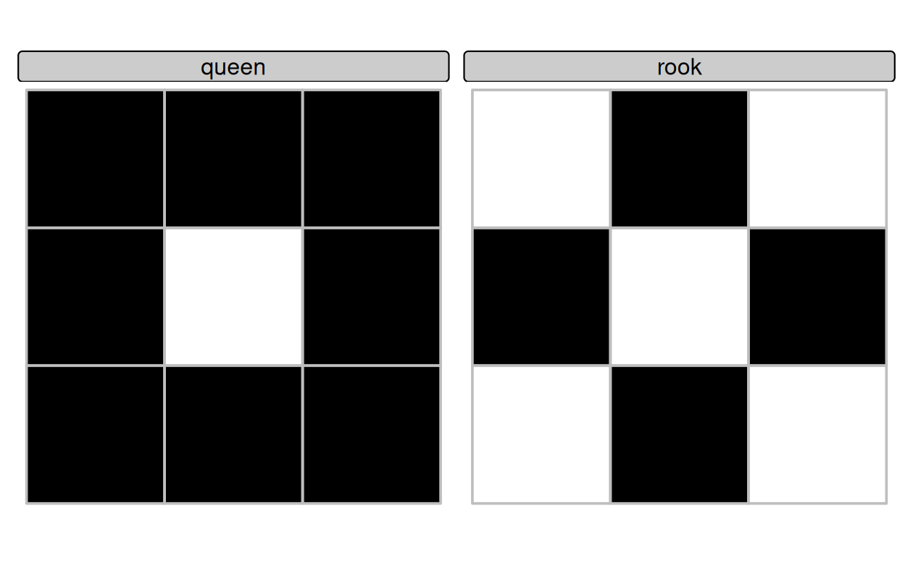
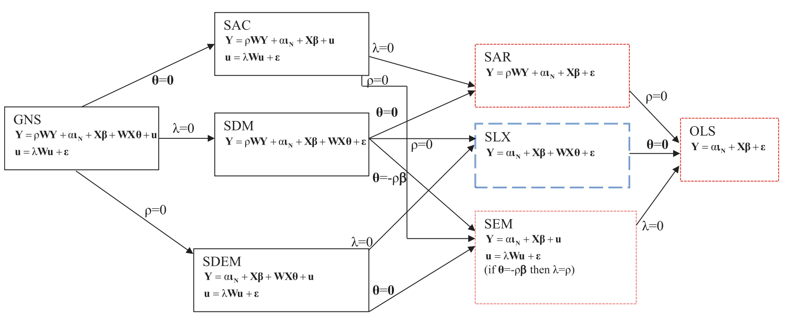

---
format:
  revealjs:
    center: false
    css: styles.css
    theme: white
    slide-number: true
    transition: fade
    width: 1600
    height: 900
    auto-stretch: false

execute:
  echo: false
---

## Spatial Data Analysis {.title-slide-low}

### Elements of spatial dependence and econometrics

Sant’Anna School of Advanced Studies

**Matteo Coronese**\
m.coronese\@santannapisa.it

June 2026

## What will we learn in this course?

### Lecture 1 Spatial data basics

### Lecture 2 — Operating with spatial datasets

### Lecture 3 — Elements of spatial dependence and econometrics


- Spatial dependence and OLS assumptions
- Variograms and Conley standard errors
- Spatial weights matrices and spatial lags
- Moran's I and LISA
- SLX, SAR and SEM models

<br>

### Lecture 4 — Applied spatial workflows

------------------------------------------------------------------------

## Is space a problem? 

> “Everything is related to everything else, but near things are more related than distant things.” 
>
>- Tobler’s First Law of Geography 

Space is not only a data format. It is a source of dependence that affects both prediction and causal inference:

- Air pollution crosses administrative borders;
- Labour markets extend beyond municipalities;
- Housing prices spill over across neighborhoods;
- Temperature shocks affect nearby regions simultaneously.

As a consequence, observations located close in space are often not independent.

**Spatial dependence** arises when observations are statistically dependent across space because of interactions, spillovers, or shared environments.


## Spatial dependence and OLS

::: {.smaller}

:::: {.columns .middle}

::: {.column width="50%"}

Consider the standard linear model:

$$
\mathbf{y} = \beta\mathbf{X} + \mathbf{\varepsilon}
$$

Key assumptions underlying OLS estimation and inference:

$$
1) \quad E[\varepsilon_i \varepsilon_j] = 0 \qquad i \neq j
$$
Errors are uncorrelated across observations.

$$
2) \quad E[\mathbf{\varepsilon} | \mathbf{X}] = 0 
$$
Exogeneity: regressors are uncorrelated with the errors.

:::

::: {.column width="50%"}

Spatial dependence creates two distinct problems:

1. **Inference problem**
   - Nearby units share common shocks $\rightarrow$ assumption 1) fails. 
   - Consequence: inefficient estimates, incorrect standard error. 

2. **Modeling problem**
   - Spatial spillovers or interactions are relevant but omitted $\rightarrow$ assumption 2) fails.
   - Consequence: biased and inconsistent estimates.

Different methods address these problems differently.

:::

::::

:::
---

## Dealing with spatial dependence

:::: {.columns .middle}

::: {.column width="40%"}
Different models encode different assumptions about how space operates:

- Conley SE: robust inference (more agnostic)
- SEM: model error dependence
- SLX: model covariate spillovers
- SAR: model outcome spillovers

The distinction is useful pedagogically, but in practice different mechanisms often coexist. You often need theory to distinguish among the various alternatives. 
:::

::: {.column width="60%"}

```text
                      Spatial dependence
                              │
                              ▼
                   What mechanism generates
                     spatial dependence?
                              │
           ┌──────────────────┴──────────────────┐
           │                                     │
           ▼                                     ▼
   Correlated errors                   Spatial interactions
    Cov(εᵢ, εⱼ) ≠ 0                        are omitted
           │                                E[ε|X] ≠ 0 
           │                                     │
      Need robust                         What interacts?
    inference only?                              │
           │                                     │
           │                                     │
      ┌────┴────┐                         ┌──────┴──────┐
      │         │                         │             │
      ▼         ▼                         ▼             ▼
     Yes       No                    Neighboring   Neighboring
      │         │                     covariates    outcomes
      │         │                         │             │
      ▼         ▼                         ▼             ▼
   Conley      SEM                       SLX           SAR
``` 
:::
::::


---

## What generates spatial dependence?
::: {.super-smaller}

:::: {.columns .middle}

::: {.column width="50%"}
Suppose we study the effect of temperature on income:

$$
Income_i = \beta Temp_i + \varepsilon_i
$$

- Spatial correlation in income *may indicate spatial dependence*.
- Spatial correlation in temperature *is not a problem per se*.

The key question is: **Does spatial dependence remain after conditioning on observed covariates?**


```text
        Spatial clustering in income
                     ↓
      Temperature may explain part of it
                     ↓
        Estimate OLS: Income ~ Temp
                     ↓
  Do income still cluster after conditioning 
on temperature (i.e. do residual still cluster?)
                     │
            ┌────────┴────────┐
            │                 │
           No                Yes
            │                 │
       Observed X     Unexplained spatial
      accounts for    dependence remains
     the clustering           │
                              ▼
                       Spatial methods
```
:::

::: {.column width="50%"}

Different mechanisms might explain spatial correlation. A heatwave arrive in Pisa:

| Mechanism                | Pisa–Livorno example                                           | Consequence                             | 
| :----------------------- | :----------------------------------------------------------- | :-------------------------------------- | :----------:
| **Shared shocks**        | Pisa and Livorno share unobserved regional factors             | (Cov($\varepsilon_i$,$\varepsilon_j$)$\neq0$)|
| **Covariate spillovers** | Workers commute: temperature in Pisa affects income in Livorno | Omitted neighboring covariates → endogeneity $(E[\varepsilon|X]\neq0)$|
| **Outcome spillovers**   | Lower income in Pisa affects economic activity in Livorno      | Omitted neighboring outcome → simultaneity $(E[\varepsilon|X]\neq0)$| 

:::

::::
:::


--- 

## Spotting spatial dependence: variograms

::: {.more-smaller}

:::: {.columns .middle}

::: {.column width="60%"}

A variogram describes how the *dis*similarity (semi-variance) between observations changes with distance. The variogram does not require a pre-specified spatial structure: it directly relies on pairwise distances between observations.

$$
\text{Semivariance} \quad \gamma(h) =
\frac{1}{2N(h)}
\sum_{(i,j)\in h}
(Z_i-Z_j)^2
$$

* $Z_i$ and $Z_j$ are the values observed in regions $i$ and $j$;
* $N(h)$ is the number of pairs of obs separated by distance ($h$).

The variogram is obtained by computing the semivariance for increasing distance classes (binning, e.g. 0–50 km, 50–100 km, etc.).

:::

::: {.column width="40%"}

```{r echo=FALSE}
library(sf)
library(tidyverse)
library(magrittr)
library(gstat)
library(latticeExtra)
boston.tr <- st_read(
  system.file("shapes/boston_tracts.gpkg", package = "spData"),
  quiet = TRUE
)
```
```{r echo=TRUE, eval=FALSE}
boston.tr <- st_read(system.file("shapes/boston_tracts.gpkg", package = "spData"))
```
```{r echo=TRUE, fig.width=5.2, fig.height=5.2}
boston_utm <- boston.tr %>% st_transform(., 32619) #utm19N
boston <- st_transform(boston_utm, 4326)
boston_utm_pts <- st_centroid(boston_utm)
vg <- variogram(MEDV ~ 1, 
                data = boston_utm_pts, 
                cutoff = 6000,
                width = 500)
```
```{r echo=TRUE, eval=FALSE}
plot(vg)
```
```{r echo=FALSE, fig.width=4, fig.height=4}
plot(vg)
trellis.focus("panel", 1, 1)

panel.abline(v = 2700,
             col = "red",
             lty = 2,
             lwd = 2)

panel.text(2000,
           20,
           "Approx. range",
           col = "red",
           pos = 4)

trellis.unfocus()
```
:::

::::

<div style="margin-top:-1em;"></div>
:::: {.columns .middle}

::: {.column width="50%"}

* **Low semivariance**: observations are similar.
* **High semivariance**: observations are more different.
* **Plateau (sill)**: beyond this point, increasing distance adds little information.

:::

::: {.column width="50%"}

* **Scale**: semivariance is scale-variant: the plateau often approximate total variance (hence the $1/2$). 
* **Range**: distance beyond which spatial dependence becomes negligible.

:::

::::


:::


---

## Spatial dependence after OLS

::: {.more-smaller}

:::: {.columns .middle}

::: {.column width="60%"}

We estimate a simple hedonic model of housing prices:

$$
MEDV_i = \beta_0 + \beta_1 CRIM_i +
\beta_2 RM_i + \beta_3 NOX_i +
\beta_4 LSTAT_i + \varepsilon_i
$$

where:

  - **MEDV** is the median housing value in the census tract;
  - **CRIM** is the per-capita crime rate;
  - **RM** is the average number of rooms per dwelling;
  - **NOX** measures air pollution concentration;
  - **LSTAT** is the share of socioeconomically disadvantaged population.

We then compute the variogram of the OLS residuals. Residual semivariance remains lower at short distances.

Spatial dependence may persist even after controlling for observable characteristics, potentially violating the OLS assumption of independent errors.

:::

::: {.column width="40%"}

```{r echo=TRUE, fig.width=4.8, fig.height=4.8}
m <- lm(
  MEDV ~ CRIM + RM + NOX + LSTAT,
  data = boston_utm_pts
)

boston_utm$resid <- resid(m)

vg_res <- variogram(
  resid ~ 1,
  data = boston_utm,
  cutoff = 6000,
  width = 500
)

plot(vg_res)
```

:::

::::

:::


---

## Spatially robust inference: Conley standard errors

::: {.smaller}

:::: {.columns .middle}

::: {.column width="60%"}

Spatially correlated residuals violate the OLS assumption of independent errors:

$$
E[\varepsilon_i \varepsilon_j] = 0
\qquad i \neq j
$$

**Conley standard errors** relax this assumption by allowing residual correlation to decay with geographic distance.

*Idea*: Nearby observations may share common shocks, while observations beyond a chosen cutoff distance are assumed independent.

Importantly, Conley does **not** modify coefficient estimates. Only the estimated uncertainty changes:

$$
\hat{\beta}_{Conley} = \hat{\beta}_{OLS} \qquad SE_{Conley} \neq SE_{OLS}
$$
In this example, we use a **2 km cutoff**, consistent with the range suggested by the residual variogram.

:::

::: {.column width="40%"}

```{r echo=TRUE}
library(fixest)

coords <- st_coordinates(st_centroid(boston))

boston$lon <- coords[,1]
boston$lat <- coords[,2]


mf <- feols(
  MEDV ~ CRIM + RM + NOX + LSTAT,
  data = boston
)

```
```{r echo=TRUE, eval=FALSE}
summary(
  mf,
  vcov = vcov_conley(cutoff = 2.5,
                lat = "lat",
                lon = "lon")
)
```
```{r echo=FALSE}
etable(
  mf,
  vcov = list(
    "IID" = "iid",
    "Conley (2 km)" =
      vcov_conley(
        cutoff = 2,
        lat = "lat",
        lon = "lon"
      )
  )
)
```

:::

::::

:::


---

## Defining spatial relationships

::: {.smaller}

:::: {.columns .middle}

::: {.column width="50%"}

Spatial methods require specifying **which observations can interact with each other**.

Unlike time series, space does not provide a natural ordering of observations:

```text
Time:      t₁ → t₂ → t₃ → t₄ → ...
Space:     ? 
```

A **spatial weights matrix** ($\mathbf{W}$) formalizes the notion of neighborhood by encoding the strength of spatial interactions between units.

The resulting matrix has this form:

$$
\mathbf{W} =
\begin{bmatrix}
0 & w_{12} & \cdots & w_{1n} \\
w_{21} & 0 & \cdots & w_{2n} \\
\vdots & \vdots & \ddots & \vdots \\
w_{n1} & w_{n2} & \cdots & 0
\end{bmatrix}
$$


:::

::: {.column width="50%"}

Simple idea: 

$$
w_{ij} =
\begin{cases}
>0 & \text{if units } i \text{ and } j \text{ are neighbors} \\
0  & \text{otherwise}
\end{cases}
$$

Typically:

- $w_{ii}=0$: a unit is not its own *neighbor*;
- larger values of $w_{ij}$ indicate stronger spatial connections;
- in classical spatial econometrics, $\mathbf{W}$ is usually specified by the researcher (advanced methods allow to estimate it)
- Depending on how *neighbors* are defined, $\mathbf{W}$ may or may not be symmetric.

:::

::::

:::


---

## How can we define neighbors?

::: {.more-smaller}

:::: {.columns .middle}

::: {.column width="50%"}

Spatial econometric models require two separate choices:

1. **Who is a neighbor?**
2. **How much weight should each neighbor receive?**

The first question defines the **neighborhood structure**:

| Approach | Definition | Typical data |
|:---|:---|:---|
| **Contiguity** | Units sharing a border | Polygons |
| **Distance bands** | Units within a fixed distance | Points or polygons |
| **k-nearest neighbors (kNN)** | Each unit is connected to its $k$ closest neighbors | Points or polygons |

Other approaches include graph-based methods (e.g. Delaunay or sphere-of-influence graphs), kernels, or economic networks (e.g. trade or commuting flows).

:::

::: {.column width="50%"}

The second question defines the **strength of spatial interactions**:

$$
w_{ij} \in \{0,1\}, \qquad
w_{ij} = \frac{1}{d_{ij}}, \qquad
w_{ij} = \frac{1}{d_{ij}^2}, \ldots
$$

A common practice is **row-standardization**, so that the weights in each row sum to one. This makes spatial lags easier to interpret as neighborhood averages, although it is not always appropriate.

```text
Without standardization (sum of neighbors)

A: 1 + 1 = 2
B: 1 + 1 + 1 + 1 = 4

With row-standardization (mean of neighbors)

A: 1/2 + 1/2 = 1
B: 1/4 + 1/4 + 1/4 + 1/4 = 1
```

:::

::::

:::


---

## Contiguity-based neighbors

::: {.smaller}

:::: {.columns .middle}

::: {.column width="50%"}

Contiguity is defined for **areal units** (polygons).

Two units are considered neighbors when they share a common boundary.

Two common definitions are:

- **Rook contiguity**: units share an **edge**;
- **Queen contiguity**: units share either an **edge or a vertex**.

<center>



</center>

:::

::: {.column width="50%"}


```{r echo=TRUE}
library(spdep)

#this creat the "graph", not yet the matrix
nb_q <- poly2nb(
  boston_utm,
  queen = TRUE
)

class(nb_q)

nb_q[[1]]
nb_q[[2]]
```
```{r echo=TRUE, eval=FALSE}
card(nb_q) #how many neighbors per each polygon
```
<div style="margin-top:-2.1em;"></div>
```{r echo=FALSE, fig.width=8.8, fig.height=6.5}
plot(
  st_geometry(boston_utm),
  border = "grey80",
  col = "white"
)

plot(
  st_geometry(boston_utm[499, ]),
  add = TRUE,
  col = "red"
)

plot(
  st_geometry(boston_utm[nb_q[[499]], ]),
  add = TRUE,
  col = "gold"
)
```

:::

::::

:::


---

## Distance-based neighbors

::: {.smaller}

:::: {.columns .middle}

::: {.column width="50%"}

Neighbor relations can also be defined using **geographic distance**.

Two observations are considered neighbors if:

$$
d_{min} < d_{ij} < d_{max}
$$

where $d_{min}$ and $d_{max}$ are chosen by the researcher.

- Unlike contiguity, distance-based neighbors can be applied to both **point-referenced** and **areal** data.

- When working with areal data, distances are often computed between **centroids**.

- The choice of the distance band is conceptually similar to the cutoff used in **Conley standard errors**.


:::

::: {.column width="50%"}

- Distance-based operations in `spdep` are generally safer in **projected CRS**.

```{r echo=TRUE}
nb_d <- dnearneigh(
  boston_utm_pts,
  0, #d_min
  10000 #d_max
)
nb_d[[499]]
nb_d[[500]]
```
<div style="margin-top:-1.7em;"></div>
```{r echo=FALSE, fig.width=8.8, fig.height=6.5}
i <- 499

plot(
  st_geometry(boston_utm),
  border = "grey80",
  col = "white"
)

plot(
  st_geometry(boston_utm[i, ]),
  add = TRUE,
  col = "red"
)

plot(
  st_geometry(
    boston_utm[nb_d[[i]], ]
  ),
  add = TRUE,
  col = "gold"
)
```


:::

::::

:::


---

## k-nearest neighbors

::: {.smaller}

:::: {.columns .middle}

::: {.column width="50%"}

- Distance bands may leave some observations without neighbors.

- A common alternative is **k-nearest neighbors (kNN)**, where each observation is connected to its $k$ closest neighbors.

- This ensures that every unit has at least $k$ neighbors:

$$
N_i = \{j_1, j_2, \ldots, j_k\}
$$

where $N_i$ denotes the set of the $k$ nearest neighbors of observation $i$.

- Unlike distance bands, the resulting graph (and matrix) may be **asymmetric**: observation $i$ may be among the nearest neighbors of $j$, but not vice versa.


:::

::: {.column width="50%"}

```{r echo=TRUE}
knn <- knearneigh(
  boston_utm_pts,
  k = 4
)

nb_knn <- knn2nb(knn)

nb_knn[[499]]
nb_knn[[495]]
```

```{r echo=FALSE, fig.width=8.8, fig.height=6.5}
i <- 499

plot(
  st_geometry(boston_utm),
  border = "grey80",
  col = "white"
)

plot(
  st_geometry(boston_utm[i, ]),
  add = TRUE,
  col = "red"
)

plot(
  st_geometry(
    boston_utm[nb_knn[[i]], ]
  ),
  add = TRUE,
  col = "gold"
)
```

:::

::::

:::


---

## From neighbor graphs to spatial weights matrices

::: {.smaller}

:::: {.columns .middle}

::: {.column width="50%"}

A **spatial weights matrix** encode the binary information in the graph, plus the **strength** of spatial interactions. 

```text
              Polygons / points
                      ↓
        poly2nb(), dnearneigh(), knn2nb()
                      ↓
              Neighbor graph (nb)
                      ↓
                  nb2listw()
                      ↓
           Spatial weights matrix W
```
Different weighting schemes = different assumptions:

```{r echo=TRUE}
# Binary weights
lw_B <- nb2listw( #sparse representation of matrix (list)
  nb_q,
  style = "B"
)
lw_B$weights[[1]]
```
```{r echo=TRUE, eval=FALSE}
nb2mat(nb_q, style = "B")[1:5,1:5] #matrix representation
```
```{r echo=TRUE}
# Row-standardized weights
lw_W <- nb2listw(
  nb_q,
  style = "W"
)
lw_W$weights[[1]]
```

:::

::: {.column width="50%"}


```{r echo=TRUE, eval=TRUE}
# Inverse-distance weights
d <- nbdists( #compute actual distances between neighbors (based on distance)
  nb_d,
  boston_utm_pts
)

nb_d[[499]]
d[[499]]

idw <- lapply( #compute inverse distance
  d,
  function(x) 1/x
)

lw_id <- nb2listw( #create the sparse matrix with explicit weights
  nb_d,
  glist = idw,
  style = "B"
)

lw_id$weights[[499]]
1/d[[499]]
```


:::

::::

:::


---

## Spatial lags as operators

::: {.smaller}

:::: {.columns .middle}

::: {.column width="50%"}

Once a spatial weights matrix $\mathbf{W}$ has been defined, it can be used as an **operator** acting on variables.

- For any variable $\mathbf{x}$, $\mathbf{Wx}$ computes a (weighted) average of neighboring values.

- If $\mathbf{W}$ is row-standardized, $(Wx)_i = \sum_j w_{ij}x_j$ can be interpreted as the (weighted) average value of variable $x$ among the neighbors of unit $i$.

- Examples:

  - $\mathbf{Wy}$: neighboring outcomes;
  - $\mathbf{WX}$: neighboring covariates;
  - $\mathbf{W^2y}$: neighbors of neighbors.

- Spatial econometric models differ mainly in **which spatial lag enters the model**.

:::

::: {.column width="50%"}

Suppose unit $i$ has three neighbors:

```text
y = [10, 20, 30]
weights = [0.2, 0.3, 0.5]
```

Its spatial lag is:

$$
Wy_i =
0.2 \times 10 +
0.3 \times 20 +
0.5 \times 30 = 23
$$

The spatial lag is therefore a weighted average of neighboring values.

```{r echo=TRUE}
lag_y <- lag.listw(
  lw_W,
  boston_utm$MEDV
)

head(lag_y)
```

:::

::::

:::


---

## Global Moran's I

::: {.smaller}

:::: {.columns .middle}

::: {.column width="55%"}

**Global Moran's I** measures whether similar values tend to occur near each other in space.

Intuition:

```text
High values near High values  → positive autocorrelation
Low values near Low values    → positive autocorrelation
High values near Low values   → negative autocorrelation
```

Moran's I can be interpreted as the spatial analogue of a correlation coefficient. It combines:

- the values of the variable of interest;
- the spatial weights matrix $\mathbf{W}$.

Values of Moran's I are interpreted as:

$$
I > 0 \quad \text{positive spatial autocorrelation (clustering)}
$$


$$
I \approx 0 \quad \text{absence of spatial autocorrelation}
$$

$$
I < 0 \quad \text{negative spatial autocorrelation (dispersion)}
$$
:::

::: {.column width="45%"}
Once a spatial weights matrix ($W$) has been specified, Moran's I provides a formal test of spatial autocorrelation.

```{r echo=TRUE, eval=FALSE}
moran.test(
  boston_utm$MEDV,
  lw_W
)
moran.test(
  resid(m),
  lw_W
)
```

$$
H_0:\ \text{no spatial autocorrelation}
\qquad (I \approx E[I]=-1/(n-1))
$$

| Variable | Moran's I | p-value |
|:---|---:|---:|
| MEDV | 0.63 | < 0.001 |
| OLS residuals | 0.49 | < 0.001 |

In particular, Moran's I measures the association between a variable and its spatial lag.
:::

::::

:::


---

## Moran scatterplot

::: {.smaller}

:::: {.columns .middle}

::: {.column width="50%"}

The Moran scatterplot relates the value observed in a location to the average value observed among its neighbors. 

- X axis: standardized variable $z_i$; 
- Y axis: its **spatial lag** $(Wz)_i$.

Formally, Moran's I is given by

$$
I=\frac{n}{S_0}
\frac{\mathbf z'W\mathbf z}
{\mathbf z'\mathbf z}
$$

where: $S_0=\sum_i\sum_j w_{ij}$ is the sum of all spatial weights ($n$ if $W$ is row-standardized)

- The term $\mathbf z'W\mathbf z$ measures whether nearby observations tend to have similar values.
- With row-standardized weights, Moran's I coincide with the slope of the regression $Wz \sim z$.

:::

::: {.column width="50%"}

```{r echo=TRUE}
z <- scale(boston_utm$MEDV)[,1]
moran.plot(
  z,
  lw_W,
  labels = FALSE,
  pch = 16,
  col = "grey40"
)
```

<div style="margin-top:-0.7em;"></div>

- **High–High (HH)**: clusters of high values;
- **Low–Low (LL)**: clusters of low values;
- **High–Low (HL)**: spatial outliers;
- **Low–High (LH)**: spatial outliers.

:::

::::

:::


---

## Local Indicators of Spatial Association (LISA)

::: {.smaller}

:::: {.columns .middle}

::: {.column width="50%"}

Global Moran's I summarizes spatial autocorrelation using a single number.

However, spatial dependence is often heterogeneous across space.

**LISA** decomposes global Moran's I into observation-specific contributions:

$$
I_i = z_i (Wz)_i
$$

where:

- $z_i$ is the standardized value in location $i$;
- $(Wz)_i$ is its spatial lag.

LISA therefore identifies **where** spatial clustering occurs.

:::

::: {.column width="50%"}

```{r echo=TRUE}
lisa <- localmoran(boston_utm$MEDV,lw_W)
head(lisa,2)
```

A LISA map can be thought of as the Moran scatterplot projected back into geographic space.

```{r echo=FALSE, fig.width=7.7, fig.height=5.7}
wz <- lag.listw(
  lw_W,
  z
)

quad <- rep(
  "Not significant",
  nrow(boston_utm)
)

sig <- lisa[,5] < 0.05

quad[
  z > 0 & wz > 0 & sig
] <- "HH"

quad[
  z < 0 & wz < 0 & sig
] <- "LL"

quad[
  z > 0 & wz < 0 & sig
] <- "HL"

quad[
  z < 0 & wz > 0 & sig
] <- "LH"

boston_utm$quad <- factor(
  quad,
  levels = c(
    "HH",
    "LL",
    "HL",
    "LH",
    "Not significant"
  )
)

ggplot(boston_utm) +
  geom_sf(
    aes(fill = quad),
    color = "white",
    linewidth = 0.1
  ) +
  scale_fill_manual(
    values = c(
      "HH" = "red",
      "LL" = "blue",
      "HL" = "orange",
      "LH" = "lightblue",
      "Not significant" = "grey90"
    )
  ) +
  theme_void() +
  labs(fill = "LISA")
```
:::

::::

:::


---

## Choosing a spatial model

::: {.more-smaller}

:::: {.columns .middle}

::: {.column width="50%"}

Spatial diagnostics can reveal spatial dependence, but they rarely identify its source. A possible empirical workflow is:

```text
Estimate OLS
      ↓
Diagnose spatial dependence
      ↓
Formulate a theoretical mechanism
      ↓
Estimate and compare spatial models
```

| Mechanism | Model | Equation |
|:---|:---|:---|
| Shared shocks / correlated errors | SEM |$y=X\beta+u$ $u=\lambda Wu+\varepsilon$ |
| Neighboring covariates matter | SLX | $y=X\beta+WX\theta+\varepsilon$ |
| Neighboring outcomes matter | SAR | $y=\rho Wy+X\beta+\varepsilon$ |


:::

::: {.column width="50%"}

Diagnostics can provide useful guidance:

| Question | Test in R |
|:---|:---|
| Residual spatial dependence? | `moran.test(resid(m), lw_W)`, `localmoran()` |
| SAR or SEM? | `lm.RStests(m, lw_W)` |

There is **no general diagnostic test for SLX**.

In practice, **SLX is often used as a flexible starting point** because it imposes weaker assumptions (and is less sensitive to $\mathbf{W}$):

- **SAR** assumes that outcomes directly affect neighboring outcomes, creating feedback loops and simultaneity;
- **SEM** assumes that unobserved shocks follow a spatial process;
- **SLX** only assumes that neighboring covariates affect local outcomes.


:::

::::

:::


---

## SLX: Spatial Lag of X

::: {.more-smaller}

:::: {.columns .middle}

::: {.column width="55%"}

The **SLX model** assumes that neighboring characteristics directly affect local outcomes.

Examples:

- Air pollution in nearby municipalities affects local health;
- A storm in Pisa affects agricultural income in Livorno;
- Nearby amenities affect housing prices.

The model augments OLS with spatially lagged covariates:

$$
\mathbf y=
\mathbf X\beta+
\mathbf{WX}\theta+
\varepsilon
$$

where:

- $\mathbf X$ contains local covariates;
- $\mathbf{WX}$ contains neighboring covariates.

SLX therefore models **spatial spillovers in explanatory variables**.


:::

::: {.column width="45%"}
Interpretation: $\beta$: direct effects; $\theta$: spillover effects.

```{r echo=TRUE, eval=FALSE}
#| class: super-small-code
boston_utm$W_CRIM <-
  lag.listw(
    lw_W,
    boston_utm$CRIM
  )

boston_utm$W_LSTAT <-
  lag.listw(
    lw_W,
    boston_utm$LSTAT
  )

slx <- lm(
  MEDV ~
    CRIM + RM + NOX + LSTAT +
    W_CRIM + W_LSTAT,
  data = boston_utm
)

moran.test(resid(slx),lw_W)

#We need lat lon to use conley, reproject
boston_wgs <- st_transform(boston_utm, 4326)
coords <- st_coordinates(
  st_centroid(boston_wgs)
)
boston_wgs$lon <- coords[,1]
boston_wgs$lat <- coords[,2]


slx <- feols(
  MEDV ~ CRIM + RM + NOX + LSTAT +
    W_CRIM + W_LSTAT,
  data = boston_wgs
)

summary(
  slx,
  vcov = vcov_conley(
    lat = "lat",
    lon = "lon",
    cutoff = 2
  )
)
```
<div style="height:1em;"></div>

| Variable | OLS | SLX | SLX + Conley |
|:---|---:|---:|---:|
| CRIM | -0.103** | -0.089* | -0.089* |
| RM | 5.219*** | 5.253*** | 5.253** |
| NOX | -0.122 | 3.161 | 3.161 |
| LSTAT | -0.577*** | -0.426*** | -0.426** |
| W_CRIM | — | 0.062 | 0.062 |
| W_LSTAT | — | -0.319*** | -0.319* |
| Adj. $R^2$ | 0.643 | 0.651 | 0.651 |
:::

::::

:::


---

## SAR: Spatial Autoregressive Model

::: {.super-smaller}

:::: {.columns .middle}

::: {.column width="55%"}

The **SAR model** assumes that outcomes directly interact across space.

Examples:

- housing prices in nearby neighborhoods;
- crime diffusion;
- epidemics and contagion processes.

The model is:

$$
\mathbf y=
\rho \mathbf{Wy}
+\mathbf X\beta
+\varepsilon
$$

- $\mathbf{Wy}$ is the spatial lag of the outcome;
- $\rho$ measures the strength of spatial dependence.

Unlike SLX, SAR generates **feedback loops**: shocks propagate through the spatial network

```text
       B         A affects B
      ↗ ↘        B affects C
     ↗   ↘       C affects A
    A ← ← C   
```

The model cannot be estimated by OLS because $\mathbf{Wy}$ is endogenous. Maximum likelihood jointly estimates $\rho$ and $\beta$.


:::

::: {.column width="45%"}

```{r echo=TRUE}
library(spatialreg)

sar <- lagsarlm(
  MEDV ~ CRIM + RM +
    NOX + LSTAT,
  data = boston_utm,
  listw = lw_W
)
```

```text
Coefficients:
              Estimate   p-value
CRIM           -0.046     0.085
RM              4.514    <0.001 ***    SAR coefficients are NOT marginal effects
NOX             3.543     0.101
LSTAT          -0.304    <0.001 ***

Rho: 0.54666, LR test value: 188.84, p-value: < 2.22e-16 #strong positive spatial dependence feedbacks
AIC: 2980.4, (AIC for lm: 3167.2) #model fit has improved
LM test for residual autocorrelation
test value: 37.175, p-value: 1.0799e-09 #still spatial dependence remaining
```

To retrieve marginal effects:

```{r echo=TRUE, eval=FALSE}
imp <- impacts(
  sar,
  listw = lw_W,
  R = 1000
)
summary(imp, zstats = TRUE)
```

```text
Impact measures (lag, exact):
                 Direct    Indirect      Total
CRIM dy/dx  -0.04931722 -0.05197838 -0.1012956
RM dy/dx     4.84834130  5.10995709  9.9582984
NOX dy/dx    3.80478493  4.01009058  7.8148755
LSTAT dy/dx -0.32697440 -0.34461789 -0.6715923
```
```text
Direct   : what happens locally?
Indirect : what happens on average elsewhere?
Total    : what happens overall?
```

:::

::::

:::


---

## SEM: Spatial Error Model

::: {.super-smaller}

:::: {.columns .middle}

::: {.column width="55%"}

The **SEM model** assumes that spatial dependence arises from **unobserved factors**.

Examples:

- school quality;
- environmental conditions;
- historical development;
- local institutions.

The model is:

$$
\mathbf y=\mathbf X\beta+\mathbf u \qquad \text{with} \qquad \mathbf u=
\lambda \mathbf{Wu}
+\varepsilon
$$
where $\lambda$ measures spatial dependence in unobserved shocks.

Unlike SAR, outcomes do **not** directly interact.

```text
Shared unobserved factors → Spatially correlated errors → Housing prices
```

SEM is conceptually close to **Conley**:

- Conley: robust inference;
- SEM: explicit modeling of spatial errors.

:::

::: {.column width="45%"}

```{r echo=TRUE}
sem <- errorsarlm(
  MEDV ~ CRIM + RM +
    NOX + LSTAT,
  data = boston_utm,
  listw = lw_W
)
```

```text
Coefficients:
              Estimate   p-value
CRIM          -0.098    <0.001 ***
RM             5.351    <0.001 ***
NOX          -17.317    <0.001 ***
LSTAT         -0.393    <0.001 ***
```

```text
λ = 0.765***     strong spatial dependence
                 in unobserved factors

AIC: 2914        (OLS: 3167)
                 (SAR: 2980)
                 better model fit
```

Interpretation:

- Nearby tracts appear to share omitted factors affecting housing prices.
- The estimated effect of NOX becomes much larger after accounting for spatially correlated omitted factors $\rightarrow$ spatial OVB.
- Unlike SAR, SEM does not generate feedback loops $\rightarrow$ coefficients retain their usual marginal interpretation.

:::

::::

:::


---

## A large family of models

<center>



<div style="height:2em;"></div>

Comparison of Different Spatial Econometric Model Specifications (Source: Vega and Elhorst 2015)

</center>

---

## Beyond cross-sections: panel data and DiD

::: {.super-smaller}

:::: {.columns .middle}

::: {.column width="50%"}

### Panel data

Fixed effects already absorb many sources of spatial dependence:

$$
y_{it}=X_{it}\beta+\mu_i+\tau_t+\varepsilon_{it}
$$

$\mu_i$ absorbs time-invariant local characteristics (e.g. geography, institutions). Spatial spillovers may still remain (e.g. pollution in one area may affect nearby areas.)

- SLX model naturally extends to panel settings: 
```{r echo=TRUE, eval=FALSE}
m <- feols(
  y ~ X + WX |
    unit + year,
  data,
    vcov = vcov_conley(
    lat = "lat",
    lon = "lon",
    cutoff = 100
  )
)
```

- `acreg` (Stata): robust inference under spatial and serial correlation.
- `splm` (R): panel estimators for SAR and SEM models.

:::

::: {.column width="50%"}

### Difference-in-Differences

Standard DiD assumes that untreated units are not affected by treatment.

Spatial spillovers may violate this assumption:

```text
Treatment in A → Outcome in B
```

Example:

```text
New subway station in A
        ↓
Housing prices increase also in B
```

In this case, B is no longer a pure control unit.

Possible approaches include:

- use Conley standard errors for spatially correlated errors;
- include spatial lags of treatment (SLX);
- define treatment exposure using distance-based measures;
- estimate dedicated spatial DiD models.


:::

::::

:::


---

## Suggested references

::: {.smaller}

### Textbooks

- Bivand, R. S., Pebesma, E. & Gómez-Rubio, V. (2013). *Applied Spatial Data Analysis with R* (2nd ed.). Springer.
- LeSage, J. P. & Pace, R. K. (2009). *Introduction to Spatial Econometrics*. Chapman & Hall/CRC.
- Anselin, L. & Rey, S. J. (2014). *Modern Spatial Econometrics in Practice: A Guide to GeoDa, GeoDaSpace and PySAL*. GeoDa Press.
- Elhorst, J. P. (2014). *Spatial Econometrics: From Cross-Sectional Data to Spatial Panels*. Springer.
- Anselin, L. (1988). *Spatial Econometrics: Methods and Models*. Kluwer Academic.

### Key papers

- Conley, T. G. (1999). “GMM Estimation with Cross Sectional Dependence.” *Journal of Econometrics*, 92(1), 1–45.
- Vega, S. H. & Elhorst, J. P. (2015). “The SLX Model.” *Journal of Regional Science*, 55(3), 339–363.
- Colella, F., Lalive, R., Sakalli, S. O. & Thoenig, M. (2023). `acreg`: Arbitrary correlation regression. *Stata Journal*, 23(1), 119–147.


:::


