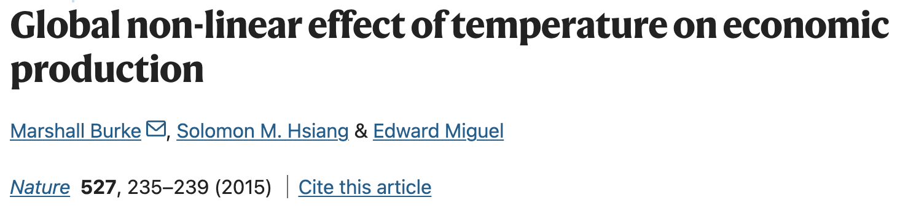
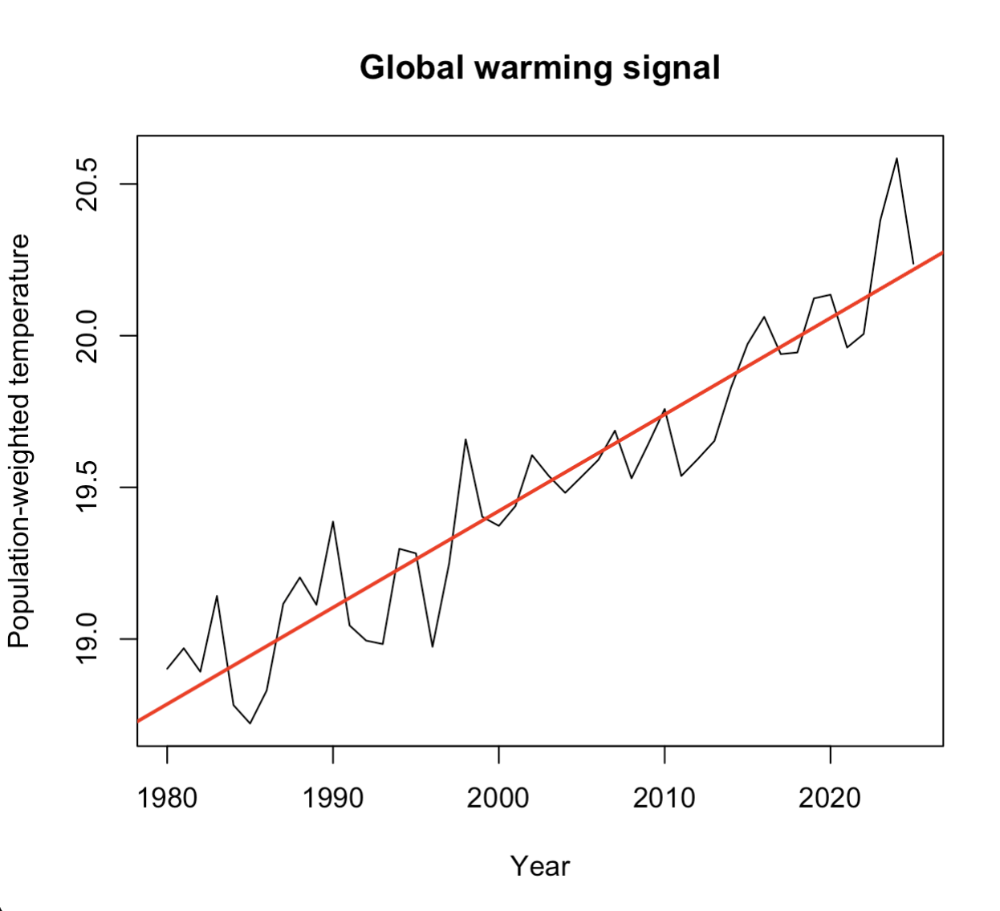
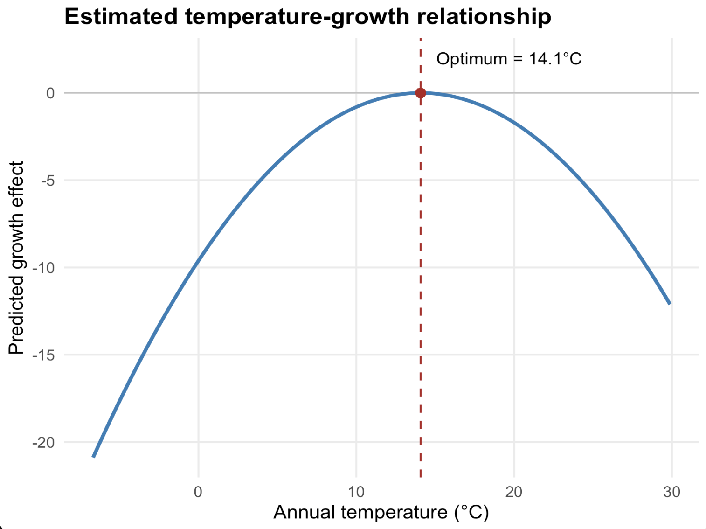

---
format:
  revealjs:
    center: false
    css: styles.css
    theme: white
    slide-number: true
    transition: fade
    width: 1600
    height: 900
    auto-stretch: false

execute:
  echo: false
---

## Spatial Data Analysis {.title-slide-low}

### Applied spatial workflows

Sant’Anna School of Advanced Studies

**Matteo Coronese**\
m.coronese\@santannapisa.it

June 2026

## What will we learn in this course?

### Lecture 1 - Spatial data basics

### Lecture 2 — Operating with spatial datasets

### Lecture 3 — Elements of spatial dependence and econometrics

### Lecture 4 — Applied spatial workflows

- Exposure variables
- Temporal and spatial harmonization
- Raster-vector interactions
- Panel construction
- Climate econometrics


---

## First things first: get the data!

Go to https://l1nk.dev/tvfd8zx 


---

## From global rasters to econometric panels

Working with spatial data often requires much more than simply fitting a regression model.

Researchers routinely need to:

* combine multiple spatial datasets;
* harmonize different grids and resolutions;
* aggregate information over administrative units;
* define meaningful weighting schemes;
* construct variables suitable for statistical analysis.

The exact workflow depends on the research question, but these operations appear repeatedly across many disciplines.

One of the most common tasks is the construction of an **exposure variable**.

---

## What is an exposure variable?

::: {.smaller}

> An **exposure variable** quantifies how much an observational unit is exposed to a spatial phenomenon.

Examples:

::: {.super-smaller}

| Unit         | Spatial phenomenon       | Exposure variable                |
| ------------ | ------------------------ | -------------------------------- |
| Country      | Temperature              | Population-weighted temperature  |
| Municipality | PM2.5                    | Population exposure to pollution |
| Household    | Flood hazard             | Flood risk                       |
| Region       | Transport infrastructure | Market accessibility             |
:::

<div style="height:1em;"></div>

Exposure variables are rarely directly observed.

Instead, they are **constructed** by combining spatial information with aggregation rules and weighting schemes.

:::: {.columns .middle}

::: {.column width="50%"}
- **Case study:** Burke, Hsiang & Miguel (*Nature*, 2015)

- A highly influential paper in climate economics that uses spatial data to estimate the effect of temperature on economic growth.
:::

::: {.column width="50%"}
<center>



</center>
:::

::::


:::

---

## A general workflow

<div style="margin-top:-5em;"></div>
<div style="zoom:1.7">
```{dot, fig.width=20, fig.height=8}

digraph workflow {

  rankdir=LR;
  splines=ortho;
  nodesep=0.6;
  ranksep=0.8;

  graph [
    fontsize=22
  ];

  node [
    shape=box,
    style="rounded,filled",
    fontsize=20,
    penwidth=2
  ];
  
  graph [
  dpi=70
];

  # Spatial inputs
  era5 [
    label="ERA5 monthly\nclimate",
    fillcolor="#B3D9FF"
  ];

  pop [
    label="Population\nrasters",
    fillcolor="#B3D9FF"
  ];

  countries [
    label="Country\npolygons",
    fillcolor="#B3D9FF"
  ];

  # Processing
  annual [
    label="Annual\naggregation",
    fillcolor="#C6F6C6"
  ];

  interp [
    label="Temporal\ninterpolation",
    fillcolor="#C6F6C6"
  ];

  align [
    label="Grid\nharmonization",
    fillcolor="#C6F6C6"
  ];

  weight [
    label="Population\nweighting",
    fillcolor="#C6F6C6"
  ];

  extract [
    label="Raster-vector\nexact_extract()",
    fillcolor="#C6F6C6"
  ];

  exposure [
    label="Country-year\nexposure",
    fillcolor="#C6F6C6"
  ];

  # Econometrics
  gdp [
    label="World Bank\nGDP",
    fillcolor="#FFCCCC"
  ];

  panel [
    label="Panel\ndataset",
    fillcolor="#FFCCCC"
  ];

  twfe [
    label="TWFE\nregression",
    fillcolor="#FFCCCC"
  ];

  edge [penwidth=2];

  era5 -> annual;
  pop -> interp;

  annual -> align;
  interp -> align;

  align -> weight;

  weight -> extract;
  countries -> extract;

  extract -> exposure;

  exposure -> panel;
  gdp -> panel;

  panel -> twfe;
}


```
</div>

<div style="margin-top:-5em;"></div>

- Climate is only one application: the same workflow can be used to study pollution, accessibility, flood risk, or habitat loss.

- The analytical choices made during construction can strongly influence scientific conclusions.

- **Goal of today's lecture:** transform **raw spatial data** into **scientific inference**.


---

## ERA5 climate data

We start from ERA5 reanalysis data, the gold standard in modern climate analysis.

We focus on data on temperature and precipitation.

- Load `temp.tif` and `prec.tif`. Function `rast()`

- Inspect the raster: `crs()`, `res()`, `extent()`, `names()`. 

> What CRS are we using?
> What is the spatial resolution?
> What is the temporal resolution, since data is covering 1980-2025?

::: {.fragment}
Names are cryptic...

- Use:

```r
names(temp) <- as.POSIXct(
  as.numeric(sub(".*=", "", names(temp))),
  origin = "1970-01-01",
  tz = "UTC"
)
```

to have nicer names.

- Do the same for `prec`.
:::


## Climate units matter

- Inspect the first monthly layer: use `global()` with `min` and `max`

::: {.fragment}
```r
global(temp[[1]], c("min", "max"), na.rm = TRUE)
```
> What's the unit for temperature? 

:::

::: {.fragment}
```r
temp <- temp - 273.15
```

- do the same for prec. 

:::

::: {.fragment}
```r
global(prec[[1]], c("min", "max"), na.rm = TRUE)
```

> Does the maximum look reasonable? 

:::

## Aggregate temperature over time

To aggregate over time, you can use the function `tapp`

```r
tapp(
  rast, #the raster object
  years, #a grouping vector, the same length as nlyr(rast)
  mean #aggregating function
)
```

You can retrieve the years vector using the lubridate function

```r
years <- format(
  as.Date(names(temp)),
  "%Y"
)
```

> Should annual temperature be computed trough a mean or a sum? 

::: {.fragment}
```r
temp_year <- tapp(
  temp, #compute month totals
  years, #over years
  mean #average across months
)
```
:::


## Aggregate precipitation over time

Temperature and precipitation behave differently.

| Variable | Type | Annual aggregation |
|----------|------|--------------------|
| Temperature | Intensive | ? |
| Precipitation | Extensive| ? |

> Should we use `sum()` or `mean()`?
> Should we multiply our values by something before aggregating? 

::: {.fragment}

```r
days <- days_in_month(
  as.Date(names(prec))
)
```
:::

::: {.fragment}

```r
prec_year <- tapp(
  prec * days, #compute month totals
  years, #over years
  sum #sum over months
) * 1000 #transform into mm
```
:::


---

## Sanity checks

- Inspect the new rasters `temp_year` and `temp_year` by computing `min`, `mean` and `max` through `global()`:
  - Temperature: roughly between -50°C and +40°C
  - Precipitation: it is measured in mm now...
- Plot random years: Can you recognize: deserts, mountain ranges, tropical regions?

::: {.fragment}
```r
global(temp_year, c("min", "mean", "max"))
global(prec_year, c("min", "mean", "max"))

plot(temp_year[[1]])
title("ERA5 Temperature, 1980")

plot(prec_year[[1]])
title("ERA5 Precipitation, 1980")
```

> Better be safe than sorry... **Never trust transformations without checking the output.**

::: 


## Population data

> "If a tree falls in a forest and no one is around to hear it, does it make a sound?"

:::: {.columns .middle}

::: {.column width="50%"}

- People tend to concentrate in cities, valleys, and coastal areas. For economic analysis, we only care about climate *experienced* by people (e.g. we don't care how hot is in a desert). 

- To account for this, we also need information on where people live.

- Data source is Gridded Population of the World (GPW v4, NASA), for 2000, 2005, 2010, 2015, 2020.

:::

::: {.column width="50%"}

- Load each of the five rasters using `rast`. 

- Combine them in a single raster using `rast(list(...))`.

- Fix layer names. 


::: {.fragment}
```r
pop2000 <- rast(
  "data/gpw_v4_population_count_adjusted_to_2015_unwpp_country_totals_rev11_2000_2pt5_min.tif"
)

pop2005 <- rast(
  "data/gpw_v4_population_count_adjusted_to_2015_unwpp_country_totals_rev11_2005_2pt5_min.tif"
)

#...

pop <- rast(
  list(
    pop2000, pop2005, pop2010, pop2015, pop2020
  )
)

names(pop) <- c("2000", "2005", "2010", "2015", "2020")
```
:::

:::

::::

---

## Sanity check: Does the population raster make sense?

Inspect the raster:

- `plot()`
- `global()`

Question:

> Can we recover world population totals?

Expected values:

- 2000 ≈ 6.1 billion
- 2005 ≈ 6.5 billion
- 2010 ≈ 6.9 billion
- 2015 ≈ 7.3 billion
- 2020 ≈ 7.8 billion

::: {.fragment}
```r
global(pop, "sum", na.rm = TRUE) / 1e9
```
:::


---

## Temporal harmonization

We need climate and population rasters to talk to each other. 

- The GPW dataset provides population counts for 2000, 2005, 2010, 2015, 2020. 

- Climate data are annual: 1980 ... 2025. 

We assume that population changes *linearly* over time.

Our strategy:

- 1980–1999 → use 2000 population
- 2000–2020 → linear interpolation
- 2021–2025 → use 2020 population

Construct a raster for population in 2003 manually.

```text
2000 -- -- -- 2003 -- -- 2005
 |              |          |
 0%            60%       100%
```

::: {.fragment}
```r
pop2003 <-
  0.4 * pop[["2000"]] +
  0.6 * pop[["2005"]]
``` 

:::

--

## Build a general interpolation function

Let's automate, building a custom function

```r

interp_rast <- function(year, rast){
  
  if(year <= 2000) # before 2000: use 2000 population
    return(rast[["2000"]])
  
  if(year >= 2020) # after 2020: use 2020 population
    return(rast[["2020"]])
  
  y0 <- floor(year / 5) * 5 # lower and upper benchmark years
  y1 <- y0 + 5
  
  weight_next <- # interpolation weight
    (year - y0) /
    (y1 - y0)
  
  (1 - weight_next) * # linear interpolation
    rast[[as.character(y0)]] +
    
    weight_next *
    rast[[as.character(y1)]]
}
```
Test the function applying it to 2003 and use `identical()` to check if it is equal to `pop2003`

::: {.fragment}
```r
test <- interp_rast(2003, pop)
identical(test, pop2003)
```
:::


## Compute all years

:::: {.columns .middle}

::: {.column width="50%"}
- Build a vector years with the input variable (1980:2025)

::: {.fragment}
```r
years <- 1980:2025
```

- Use lapply to apply the function to every year
:::
::: {.fragment}
```r
pop_yearly <- lapply(
  years,
  interp_rast,
  rast = pop
)
```
- Inspect the object with class() and length() 
:::
::: {.fragment}
```r
class(pop_yearly)
length(pop_yearly)
class(pop_yearly[[1]])
```

> Why is the result a LIST? Because each element is a raster.

:::

:::

::: {.column width="50%"}
::: {.fragment}

- Stack everything into a single raster object
:::

::: {.fragment}
```r
pop_yearly <- rast(pop_yearly)
```

- Fix the names of the layers
:::
::: {.fragment}
```r
names(pop_yearly) <- years
```

- Reinspect the object. How many layers do you expect? 
:::
::: {.fragment}
```r
class(pop_yearly)

nlyr(pop_yearly)

pop_yearly
```

- Perform a sanity check: compute global population by year
:::

::: {.fragment}
```r
global(pop_yearly, "sum", na.rm = TRUE) / 1e9
```

::: 


:::

::::

::: {.fragment}
> Under which circumstances using 2000 population for 1980–1999
is potentially problematic?
:::


---

## Spatial harmonization

:::: {.columns .middle}

::: {.column width="50%"}

Climate and socio-economic data rarely share the same grid.

Before combining rasters, we must answer two questions:

1. Do they have the same **resolution**?
2. Are their cells **aligned** in space?

- Let's start with resolution. Compare climate and population rasters using `res()`. What differences do you observe?

::: {.fragment}
```r
res(prec_year)
res(pop_yearly)
```

- Compute the ratio: how many cells from pop_yearly fit into a cell from prec_year?
:::
::: {.fragment}
```r
res(prec_year)/res(pop_yearly)
```
:::

:::

::: {.column width="50%"}

::: {.fragment}

```{r echo=FALSE, fig.width=8, fig.height=8}
library(ggplot2)
library(dplyr)

# Population grid: 6x6 small cells
pop <- expand.grid(
  x = 0:5,
  y = 0:5
)

ggplot() +
  
  # ERA5 cell
  geom_rect(
    aes(
      xmin = 0, xmax = 6,
      ymin = 0, ymax = 6
    ),
    fill = "lightblue",
    alpha = 0.2,
    color = "steelblue",
    linewidth = 5
  ) +
  
  # Population cells
  geom_tile(
    data = pop,
    aes(
      x = x + 0.5,
      y = y + 0.5
    ),
    fill = "orange",
    color = "white",
    linewidth = 0.8
  ) +
  
  annotate(
    "text",
    x = 3,
    y = 6.4,
    label = "One ERA5 cell (0.25° × 0.25°)",
    color = "steelblue",
    size = 6,
    fontface = "bold"
  ) +
  
  annotate(
    "text",
    x = 3,
    y = -0.6,
    label = "36 population cells (2.5 arc-min)",
    color = "orange",
    size = 5
  ) +
  
  coord_equal() +
  theme_void() +
  xlim(-0.5, 6.5) +
  ylim(-1, 7)

```

:::

:::

::::


---

## Aggregating smaller raster

> The empirical bottleneck is always given by the coarser dataset. 

- Population is an extensive variable. When aggregating cells should we use `sum()` or `mean()`?

- Use the function aggregate to aggregate by a factor of six. Sintax:

```r
aggregate(
  raster, #raster object
  fact = n, #factor of aggregation
  fun = "fun", #aggregating function
  na.rm = TRUE #options
)

```
::: {.fragment}
```r
pop_15 <- aggregate(
  pop_yearly,
  fact = 6,
  fun = "sum",
  na.rm = TRUE
)
```

- Sanity checks. Check the resolution of `pop_15`. Compare annual global population between `pop_15` and `pop_yearly`.

:::
::: {.fragment}
```r
res(pop_15)
global(pop_15, "sum", na.rm = TRUE) / 1e9
global(pop_yearly, "sum", na.rm = TRUE) / 1e9
```
:::


---

## Spatial harmonization: alignin grids
:::: {.columns .middle}

::: {.column width="50%"}

Our rasters now share the same resolution. But are they *aligned*? 

- Check using `ext()` and `origin()`.

::: {.fragment}
```r
ext(pop_15)
ext(prec_year)
origin(pop_15)
origin(prec_year)
```


:::

:::

::: {.column width="50%"}

::: {.fragment}

The two rasters are *misaligned* both vertically and horizontally by half cell. 

```{r echo=FALSE, fig.width=7, fig.height=7}
# Population grid (aligned at integers)
pop <- expand.grid(
  x = 0:5,
  y = 0:5
)

# ERA5 grid shifted by half a cell
era <- pop
era$x <- era$x-0.5

ggplot() +
  
  # Population grid
  geom_tile(
    data = pop,
    aes(
      x = x + 0.5,
      y = y + 0.5
    ),
    fill = "orange",
    color = "white",
    alpha = 0.7
  ) +
  
  # ERA5 grid (shifted)
  geom_rect(
    data = era,
    aes(
      xmin = x,
      xmax = x + 1,
      ymin = y,
      ymax = y + 1
    ),
    fill = NA,
    color = "steelblue",
    linewidth = 0.8
  ) +
  
  annotate(
    "segment",
    x = 0,
    xend = 0.5,
    y = -0.3,
    yend = -0.3,
    arrow = arrow(length = unit(0.2, "cm")),
    linewidth = 1
  ) +
  
  annotate(
    "text",
    x = 1.8,
    y = -0.6,
    label = "0.5 cell shift\n(0.125°)",
    size = 5
  ) +
  
  annotate(
    "text",
    x = 4.5,
    y = 6.5,
    label = "Population grid",
    color = "orange",
    size = 6,
    fontface = "bold"
  ) +
  
  annotate(
    "text",
    x = 0.5,
    y = 6.5,
    label = "ERA5 grid",
    color = "steelblue",
    size = 6,
    fontface = "bold"
  ) +
  
  coord_equal() +
  theme_void() +
  xlim(-1, 6) +
  ylim(-1, 7)

```


:::

:::

::::


## Spatial interpolation
:::: {.columns .middle}

::: {.column width="50%"}

- A common fix to this problem is to **interpolate** values on *one grid* relative to the position of each cell in *another grid*. 

- Among many methods, we are going to use the **bilinear** interpolation. We assign to each cell the average of the four nearest cells, 

```{r echo=FALSE, fig.width=5.5, fig.height=5.5}
cells <- data.frame(
  xmin = c(0, 1, 0, 1),
  xmax = c(1, 2, 1, 2),
  ymin = c(0, 0, 1, 1),
  ymax = c(1, 1, 2, 2),
  value = c(100, 200, 300, 400)
)

ggplot() +
  
  geom_rect(
    data = cells,
    aes(
      xmin = xmin,
      xmax = xmax,
      ymin = ymin,
      ymax = ymax
    ),
    fill = "orange",
    color = "white",
    alpha = 0.7,
    linewidth = 1
  ) +
  
  geom_text(
    data = cells,
    aes(
      x = (xmin + xmax)/2,
      y = (ymin + ymax)/2,
      label = value
    ),
    size = 8,
    fontface = "bold"
  ) +
  
  # target location
  geom_point(
    aes(x = 1.3, y = 1.2),
    color = "steelblue",
    size = 8
  ) +
  
  annotate(
    "label",
    x = 1.3,
    y = 1.75,
    label = "ERA5 cell center",
    color = "steelblue",
    fill = "white",
    size = 5
  ) +
  
  geom_segment(
    aes(x = 1.3, y = 1.2, xend = 0.5, yend = 0.5),
    arrow = arrow(length = unit(0.15, "cm"))
  ) +
  
  geom_segment(
    aes(x = 1.3, y = 1.2, xend = 1.5, yend = 0.5),
    arrow = arrow(length = unit(0.15, "cm"))
  ) +
  
  geom_segment(
    aes(x = 1.3, y = 1.2, xend = 0.5, yend = 1.5),
    arrow = arrow(length = unit(0.15, "cm"))
  ) +
  
  geom_segment(
    aes(x = 1.3, y = 1.2, xend = 1.2, yend = 1.65),
    arrow = arrow(length = unit(0.15, "cm"))
  ) +
  
  annotate(
    "text",
    x = 1.3,
    y = 0.8,
    label = "weighted average\nof nearby cells",
    color = "steelblue",
    size = 5
  ) +
  
  coord_equal() +
  theme_void() +
  xlim(-0.2, 2.5) +
  ylim(-0.2, 2.2)
```

:::

::: {.column width="50%"}

::: {.fragment}


Use the command `resample`. Sintax: 

```r
resample(
  resampled_raster,
  target_raster,
  method = "bilinear"
)
```
:::

::: {.fragment}

```r
pop_era5 <- resample(
  pop_15,
  prec_year,
  method = "bilinear"
)
```

- Sanity checks
  - Geometries should now match. Check with `compareGeom`. 
  - World population totals should remain *approximately* unchanged.

:::
::: {.fragment}
```r
compareGeom( pop_era5, prec_year, stopOnError = FALSE)
global(pop_era5, "sum", na.rm = TRUE) / 1e9
```
:::


:::

::::


---

## From rasters to countries

Until now we worked with rasters.

However, econometric analysis is often performed at the country level.

We therefore need country polygons to aggregate raster information.

First, download country polygons: 

```r
countries <- rnaturalearth::ne_countries(
  scale = "medium",
  returnclass = "sf"
)
```

- Use `st_crs` and `crs` to check compatibility 
- Use `plot()` and `plot(., add=TRUE)` to have visual overlay confirmation

::: {.fragment}
```r
st_crs(countries)
crs(temp_year)
plot(prec_year[[1]])
plot(st_geometry(countries), add = TRUE)
```
:::


---
  
## Zonal statistics and exact extraction

:::: {.columns .middle}

::: {.column width="50%"}

We now want to aggregate raster values over polygons. This operation is known as **zonal statistics**. 

Cells intersecting country borders are only partially counted. Through exact extraction, boundary cells contribute proportionally to their covered area.
  
```r
exact_extract(
  raster,
  polygon,
  fun #aggregating function
)
```


:::

::: {.column width="50%"}

<center>
```{r echo=FALSE, fig.width=7, fig.height=7}
library(sf)
cells <- expand.grid(
  x = 0:4,
  y = 0:4
)

# Irregular country polygon
country <- st_polygon(list(rbind(
  c(0.8,0.5),
  c(3.8,0.8),
  c(4.2,2.5),
  c(3.2,4.0),
  c(1.0,3.8),
  c(0.4,2.0),
  c(0.8,0.5)
))) |> st_sfc()

ggplot() +
  
  geom_tile(
    data = cells,
    aes(
      x = x + 0.5,
      y = y + 0.5
    ),
    fill = "orange",
    color = "white",
    linewidth = 1
  ) +
  
  geom_sf(
    data = country,
    fill = "lightblue",
    alpha = 0.35,
    color = "steelblue",
    linewidth = 2,
    inherit.aes = FALSE
  ) +
  
  # Example partial cells
  annotate(
    "text",
    x = 3.5,
    y = 1.5,
    label = "0.95",
    size = 6,
    fontface = "bold"
  ) +
  
  annotate(
    "text",
    x = 1.5,
    y = 0.78,
    label = "0.4",
    size = 6,
    fontface = "bold"
  ) +
  
  annotate(
    "text",
    x = 2.5,
    y = 2.5,
    label = "1",
    size = 6,
    fontface = "bold"
  ) +
  
  annotate(
    "text",
    x = 1.5,
    y = 3.5,
    label = "0.85",
    size = 6,
    fontface = "bold"
  ) +
  
  coord_sf(expand = FALSE) +
  theme_void()

```

</center>
:::

::::


---

## Further weighting: population weighting

:::: {.columns .middle}

::: {.column width="50%"}

We are not simply using zonal statistic, but a weighted (by population) version of it.  A hot desert and a large city should not contribute equally.

Population-weighted temperature is defined as:

$$
T^{PW} =
\frac{\sum_i T_i \times Pop_i}
{\sum_i Pop_i}
$$

where \(i\) indexes raster cells.


- First compute the denominator $T_i \times Pop_i$ for every raster cell:

::: {.fragment}
```r
temp_pop <- temp_year * pop_era5
prec_pop <- prec_year * pop_era5

```
:::

:::

::: {.column width="50%"}

::: {.fragment}
- Then, extract them and the denominator (`pop_era5`) using `exact_exctract()`. Which aggregating function should we use? 
:::
::: {.fragment}

```r
temp_num <- exact_extract(
  temp_pop,
  countries,
  "sum"
)

prec_num <- exact_extract(
  prec_pop,
  countries,
  "sum"
)

pop_den <- exact_extract(
  pop_era5,
  countries,
  "sum"
)

```
:::

:::

:::


---

## Further weighting: population weighting II

:::: {.columns .middle}

::: {.column width="50%"}

- At this point, simply build the weighted measures conmputing the ratios

::: {.fragment}
```r
temp_pw <- temp_num / pop_den
prec_pw <- prec_num / pop_den
```

- Sanity check: check dimensions with `dim()` and inspect values with `summary()`
:::
::: {.fragment}
```r
dim(temp_pw)
dim(prec_pw)

summary(as.matrix(temp_pw))
summary(as.matrix(prec_pw))
```
:::
::: {.fragment}
- Do they make sense? 

- Use the function `colMeans(., na.rm = TRUE)` to inspect and plot average temperature by year. We should see an increase...
:::

:::

::: {.column width="50%"}

::: {.fragment}
<center>

</center>

Is this evidence of climate change? Of course a bit, but not necessarily: population weights also evolve over time.

:::

:::

::::


---

## Housekeeping

:::: {.columns .middle}

::: {.column width="50%"}
- Remove NA's
```r
keep <- !apply(is.na(temp_pw), 1, all)

countries <- countries[keep, ]
temp_pw   <- temp_pw[keep, ]
prec_pw   <- prec_pw[keep, ]

temp_df <- as.data.frame(temp_pw)
prec_df <- as.data.frame(prec_pw)

years <- 1980:2025

names(temp_df) <- paste0("temp_", years)
names(prec_df) <- paste0("prec_", years)
```

- Use the command cbind to attach temp_df and prec_df columns to countries

```r
countries %>%
  st_drop_geometry() %>%
  transmute(
    iso3 = adm0_a3, #we call the identifies iso3
    country = name  
  ) %>%
  bind_cols(
    temp_df,
    prec_df,
  )
```
:::

::: {.column width="50%"}
- For most econometric software, you need data in long format. Inspect the names of you columns and use pivot_longer()

```r
names(panel_wide)

panel <- panel_wide %>%
  pivot_longer(
    cols = -c(iso3, country),
    names_to = c(".value", "year"),
    names_sep = "_"
  ) %>%
  mutate(
    year = as.integer(year)
  )
```
:::

::::


---

## Economic data

:::: {.columns .middle}

::: {.column width="50%"}


-vNow, we only need GDP data. Dowload it from the World Bank repository: 

::: {.fragment}
```r
gdp <- WDI::WDI(
  country = "all",
  indicator = "NY.GDP.PCAP.PP.KD",
  start = 1980,
  end = 2025
)
```

- Perform a `left_join()` with you object panel
:::
::: {.fragment}

```r
panel <- panel %>%
  left_join(
    gdp %>% select(iso3c, year, NY.GDP.PCAP.PP.KD),
    by = c("iso3" = "iso3c", "year")
  )
```
  
- Use `filter()` to remove observations without GDP information

:::
::: {.fragment}
```r
panel <- panel %>%
  filter(
    !is.na(NY.GDP.PCAP.PP.KD)
  )
```

:::

:::
::: {.column width="50%"}

::: {.fragment}

- Use `group_by()` and `mutate()` to compute the rate of growth of GDP:
:::

::: {.fragment}
```r
panel <- panel %>%
  arrange(
    iso3,
    year
  ) %>%
  group_by(iso3) %>%
  mutate(
    growth = 100 * (
      log(NY.GDP.PCAP.PP.KD) -
        lag(log(NY.GDP.PCAP.PP.KD))
    )
  ) %>%
  ungroup()
```

- Sanity checks: are these growth rates reasonable? Use `summary()`

:::
::: {.fragment}
```r
summary(panel$growth)
quantile(
  panel$growth,
  probs = c(.01, .05, .5, .95, .99),
  na.rm = TRUE
)
```
:::

:::

::::


---

## Why a quadratic specification?

Now we have built our panel with exposure variables. In Burke, Hsiang & Miguel (2015), the question is:

> Does temperature affect economic growth?

They further argue that such relationship is non-linear. 

- Very cold countries may benefit from warming.

- Very hot countries may be harmed.

A simple way to capture this idea is:

$$
\text{growth} =
\beta_1 T +
\beta_2 T^2
$$

- Why growth? 
- Which sign would you expect for $\beta_2$?

::: {.fragment}

If $(\beta_2 < 0)$, the relationship is hump-shaped. Temperature can increase growth up to a point, and reduce it afterwards.

:::


---

## Empirical specification

::: {.smaller}

$$
g_{it}
=
\beta_1 T_{it}
+
\beta_2 T_{it}^2
+
\beta_3 P_{it}
+
\beta_4 P_{it}^2
+
\alpha_i
+
\lambda_t
+
\delta_i t
+
\gamma_i t^2
+
\varepsilon_{it}
$$

:::: {.columns .middle}

::: {.column width="50%"}

where:

- $g_{it}$: GDP per capita growth
- $T_{it}$: temperature exposure
- $P_{it}$: precipitation exposure


### Why country fixed effects $(\alpha_i)$?

::: {.fragment}

To absorb time-invariant country characteristics:

- geography;
- institutions;
- culture;
- average climate.

:::

:::

::: {.column width="50%"}

::: {.fragment}

### Why year fixed effects $(\lambda_t)$?

:::

::: {.fragment}

To absorb global shocks affecting all countries:

- oil crises;
- business cycles;
- technological change.


### Why country-specific trends $(\delta_i t + \gamma_i t^2)$?

:::

::: {.fragment}

To remove slow-moving country-specific processes.

- economic convergence;
- demographic transition;
- institutional reforms.

We allow each country to follow its own smooth trajectory.

:::

:::


::::


:::


## Where does identification come from?

After all these controls, the model is identified from:

> year-to-year climate fluctuations within a country

We are not comparing:

- Italy vs Norway
- Brazil vs Sweden

We are comparing:

- Italy in warmer years vs cooler years
- Brazil in warmer years vs cooler years

while controlling for long-run trends and global shocks.


## Estimating the model

::: {.smaller}

:::: {.columns .middle}

::: {.column width="50%"}
Use `feols()` to estimate the Burke specification.

General syntax:

```r
feols(
  y ~ x1 + x2 + ... |
    fe_1 + fe_2,
  data = data,
  cluster = ~unit
)
```

For this exercise:

- dependent variable: `growth`
- climate variables: `temp`, `temp^2`, `prec`, `prec^2`
- country fixed effects: `iso3`
- year fixed effects: `year`
- cluster variable: `iso3`

To include country-specific polynomial trends, use:

```r
iso3[t + I(t^2)]
```

which estimates, for each country, $\alpha_i + \delta_i t + \gamma_i t^2$

:::

::: {.column width="50%"}

::: {.fragment}

```r
m1 <- feols(
  growth ~ temp + I(temp^2) +
    prec + I(prec^2) |
    iso3[t + I(t^2)] + year,
  data = panel,
  cluster = ~iso3
)
```

- Why include precipitation?
- Why include quadratic terms?
- Why cluster standard errors by country?
- Use `coef()` to retrieve estimated coefficients and compute the vertex of the parabola ($v=-\beta1_/(2\beta_2)$).
- Is the estimated optimum close to the original ~13°?

:::

::: {.fragment}

```r
-coef(m1)["temp"]/(2*coef(m1)["I(I(temp^2))"])
```
:::

:::

::::

:::


---

## Winsorizing - Extreme growth episodes

::: {.smaller}

:::: {.columns .middle}

::: {.column width="50%"}

- Iraq 1991 (war); Equatorial Guinea 1997 (oil discovery).
- Other possible outliers from political collapses, measurement errors.

Why are outliers potentially problematic?

::: {.fragment}

- OLS squares residuals. Large observations therefore receive disproportionate weight.
- Our specification also contains quadratic climate terms. Extreme observations may therefore have a strong influence on the estimated curve.

Solution: **winsorize growth**

```r
panel2 <- panel %>%
  mutate(
    growth_w = pmax(
      pmin(growth, 15),
      -15
    )
  )
```

:::


:::

::: {.column width="50%"}

::: {.fragment}
Re-estimate the model: 
:::

::: {.fragment}
```r
m2 <- feols(
  growth_w ~ temp + I(temp^2) +
    prec + I(prec^2) |
    iso3[ t + I(t^2) ] + year,
  data = panel2,
  cluster = ~iso3
)
```





:::

:::

::::

:::